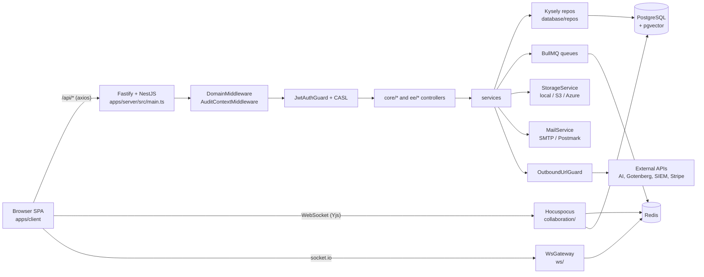

## Architecture Notes

`boltplan` (root `package.json` name, version `0.96.0`) is a fork of [Docmost](https://docmost.com) — a collaborative wiki. It is a **pnpm + Nx monorepo** with two deployable apps and three shared packages. There is no microservice split: the product ships as a single Node container (`Dockerfile`) that serves the built React SPA and the REST API from the same Fastify instance, with Postgres and Redis as the only required infrastructure (`docker-compose.yml`).

The design is deliberately "one process, many modules": NestJS modules provide the seams instead of network boundaries. The one exception is real-time document editing, which can run either inside the main process or as a **separate collaboration process** (`apps/server/src/collaboration/server/collab-main.ts`, started with `pnpm collab`) that synchronizes through Redis.

Enterprise features are physically separated into `ee/` trees (`apps/server/src/ee`, `apps/client/src/ee`, `packages/ee`) under a different license, and the server loads them **dynamically with a `require` inside `try/catch`** ([apps/server/src/app.module.ts:36](../../apps/server/src/app.module.ts#L36)) so a community build that deletes `src/ee` still boots. When `CLOUD=true`, a failed EE load is fatal instead.

## System Architecture Overview

Topology, following a request end to end:

1. The browser loads the SPA built by Vite (`apps/client`). In production the bundle is served by `StaticModule` from the same server.
2. XHR calls go to `/api/*` through a single axios instance ([apps/client/src/lib/api-client.ts](../../apps/client/src/lib/api-client.ts)), which unwraps `response.data` and centralizes 401/404 redirects.
3. Fastify receives the request. `main.ts` registers `fastify-ip`, `@fastify/multipart`, `@fastify/cookie`, frame/CSP headers, and a `preHandler` hook that rejects any `/api` route with no resolved `workspaceId` (short allowlist for setup/health/webhook routes).
4. `DomainMiddleware` resolves the tenant workspace from the hostname and attaches it to `req.raw.workspaceId`; `AuditContextMiddleware` seeds an `AuditContext` into `nestjs-cls` request storage. Both are wired in [apps/server/src/core/core.module.ts:51](../../apps/server/src/core/core.module.ts#L51).
5. `JwtAuthGuard` authenticates, then CASL ability factories authorize per space/page.
6. Controllers delegate to services; services use **Kysely repositories** (`apps/server/src/database/repos/*`) — there is no ORM entity layer.
7. Responses pass through `TransformHttpResponseInterceptor` to a uniform envelope, unless the handler is marked with `@SkipTransform()`.
8. Side effects fan out to BullMQ queues (Redis), socket.io rooms (`apps/server/src/ws`), and Hocuspocus/Yjs documents (`apps/server/src/collaboration`).

Deployment model: one image per release built by `scripts/build-and-push-ghcr.sh` and rolled out to Portainer stacks (`.github/infra/stack-dev.yml`, `stack-prod.yml`) via `pnpm deploy:dev` / `pnpm deploy:prod`.

## Architectural Layers

- **Client SPA** — React 19 + Vite + Mantine, organized feature-first: `apps/client/src/features/<domain>/{components,queries,services,types,atoms,hooks}`. Routes live in [apps/client/src/App.tsx](../../apps/client/src/App.tsx) with constants in [apps/client/src/lib/app-route.ts](../../apps/client/src/lib/app-route.ts).
- **Client enterprise overlay** — `apps/client/src/ee/*` mirrors the same feature shape (ai, ai-chat, base, billing, mfa, scim, siem, templates, page-permission…) and is gated by entitlements (`apps/client/src/ee/entitlement`).
- **HTTP/transport** — `apps/server/src/main.ts`, `apps/server/src/common/{interceptors,guards,decorators,middlewares}`.
- **Domain modules (core)** — `apps/server/src/core/*`: `attachment`, `auth`, `casl`, `comment`, `favorite`, `group`, `label`, `notification`, `page`, `public-space`, `search`, `session`, `share`, `space`, `user`, `watcher`, `workspace`. Each is a NestJS module with `*.controller.ts`, `services/`, and `dto/`.
- **Domain modules (enterprise)** — `apps/server/src/ee/*`: `ai`, `ai-chat`, `api-key`, `audit`, `base`, `mcp`, `mfa`, `page-verification`, `scim`, `security`, `template`.
- **Persistence** — `apps/server/src/database`: `repos/` (query objects), `migrations/` (54 timestamped Kysely migrations), `types/db.d.ts` (generated by `kysely-codegen`), `pagination/`, `listeners/`, `helpers/`.
- **Real-time** — `apps/server/src/collaboration` (Hocuspocus + Yjs document sync, persistence/authentication/redis-sync extensions) and `apps/server/src/ws` (socket.io gateway for tree/presence/notification events).
- **Integrations** — `apps/server/src/integrations`: `storage`, `mail`, `queue`, `redis`, `export`, `import`, `security`, `outbound`, `encryption`, `environment`, `audit`, `telemetry`, `throttle`, `static`, `health`, `transactional` (react-email templates).
- **Shared packages** — `packages/editor-ext` (Tiptap/ProseMirror nodes and the docx serializer), `packages/base-formula` (tokenizer → parser → typecheck → eval formula engine for Bases), `packages/ee` (enterprise license text).

> Use `context({ action: "getMap", section: "all" })` for generated architecture and dependency summaries.

## Detected Design Patterns

| Pattern | Confidence | Locations | Description |
|---------|------------|-----------|-------------|
| Modular monolith | High | `apps/server/src/{core,ee,integrations}` | NestJS modules are the only boundary; one process, one deployable. |
| Repository | High | `apps/server/src/database/repos/*` (e.g. `page/page.repo.ts`, `space/space.repo.ts`) | Hand-written Kysely query objects per aggregate, injected into services. |
| Layered module (controller → service → repo) | High | `apps/server/src/core/page/{page.controller.ts,services,dto}` | Controllers validate + authorize, services hold rules, repos touch SQL. |
| Dynamic module / async factory | High | `StorageModule.forRootAsync`, `MailModule.forRootAsync`, `CacheModule.registerAsync`, `RedisModule.forRootAsync` in [app.module.ts](../../apps/server/src/app.module.ts) | Driver selection at bootstrap from `EnvironmentService`. |
| Strategy (pluggable drivers) | High | `integrations/storage` (local/S3/Azure), `integrations/mail` (SMTP/Postmark), `ee/ai/providers` (OpenAI/Google/Ollama/compatible) | One interface, driver chosen by env var. |
| Optional-plugin loading | High | [app.module.ts:36](../../apps/server/src/app.module.ts#L36) | `require('./ee/ee.module')` in `try/catch`; community builds run without `ee/`. |
| Ability factory (CASL) | High | `apps/server/src/core/casl/abilities/space-ability.factory.ts`, `core/page/page-access` | Per-request abilities keyed by space/page role. |
| Global interceptor / envelope | High | `common/interceptors/http-response.interceptor.ts` + `@SkipTransform()` | Uniform `{ data, success, status }`-style responses with per-route opt-out. |
| Request-scoped context (CLS) | Medium | `ClsModule` + `common/middlewares/audit-context.middleware.ts` | Audit actor/tenant propagated without threading params. |
| Producer/consumer queues | High | `integrations/queue/processors/*`, `collaboration/processors/history.processor.ts` | BullMQ jobs for email, import/export, AI embeddings, page history. |
| Gateway + Redis pub/sub adapter | High | `ws/ws.gateway.ts`, `ws/adapter/ws-redis.adapter.ts`, `collaboration/extensions/redis-sync` | Horizontal scaling of websockets across replicas. |
| Guard / decorator metadata | High | `common/decorators/{public,oauth-scope,skip-transform,auth-user,auth-workspace}.decorator.ts` | Declarative cross-cutting behavior read via `Reflector`. |
| CRDT state sync | High | `collaboration/*`, `packages/editor-ext` | Yjs documents are the source of truth while a page is open; snapshots persist to Postgres. |
| Pipeline/interpreter | High | `packages/base-formula/src/{tokenizer,parser,typecheck,eval}.ts` | Classic front-end compiler pipeline for base formulas. |

## Entry Points

- [apps/server/src/main.ts](../../apps/server/src/main.ts) — HTTP/API + SPA host (`PORT`, default 3000). Bootstraps `AppModule`, global `api` prefix, `ValidationPipe`, websocket adapter.
- [apps/server/src/collaboration/server/collab-main.ts](../../apps/server/src/collaboration/server/collab-main.ts) — standalone collaboration process (`pnpm collab`, `pnpm collab:dev`).
- [apps/server/src/database/migrate.ts](../../apps/server/src/database/migrate.ts) — migration CLI (`migration:latest`, `migration:create`, `migration:down`…).
- [apps/client/src/main.tsx](../../apps/client/src/main.tsx) → [apps/client/src/App.tsx](../../apps/client/src/App.tsx) — SPA root and router.
- [packages/editor-ext/src/index.ts](../../packages/editor-ext/src/index.ts) — shared editor extension exports consumed by client and server.
- `packages/base-formula` exposes two entries, `index.server.ts` and `index.client.ts` (see the `moduleNameMapper` in `apps/server/package.json`).
- `scripts/build-and-push-ghcr.sh`, `scripts/deployportainer.sh`, `scripts/createdb.sh` — operational entry points.

## Public API

The server exposes REST under `/api` plus a few unprefixed public routes. Representative surface:

| Symbol | Type | Location |
|--------|------|----------|
| `AppModule` | NestJS root module | [apps/server/src/app.module.ts:114](../../apps/server/src/app.module.ts#L114) |
| `CoreModule` | Module aggregate (17 domains) | [apps/server/src/core/core.module.ts:51](../../apps/server/src/core/core.module.ts#L51) |
| `EeModule` | Enterprise module aggregate | [apps/server/src/ee/ee.module.ts:29](../../apps/server/src/ee/ee.module.ts#L29) |
| `DatabaseModule` | Kysely wiring + repo providers | [apps/server/src/database/database.module.ts:125](../../apps/server/src/database/database.module.ts#L125) |
| `PageController` | `POST /api/pages/*` | [apps/server/src/core/page/page.controller.ts](../../apps/server/src/core/page/page.controller.ts) |
| `CollaborationGateway` | Hocuspocus gateway | [apps/server/src/collaboration/collaboration.gateway.ts:31](../../apps/server/src/collaboration/collaboration.gateway.ts#L31) |
| `WsGateway` | socket.io events | [apps/server/src/ws/ws.gateway.ts:24](../../apps/server/src/ws/ws.gateway.ts#L24) |
| `StorageService` | storage driver facade | [apps/server/src/integrations/storage/storage.service.ts:7](../../apps/server/src/integrations/storage/storage.service.ts#L7) |
| `MailService` | mail driver facade | [apps/server/src/integrations/mail/mail.service.ts:12](../../apps/server/src/integrations/mail/mail.service.ts#L12) |
| `OutboundUrlGuard` | SSRF guard for user-supplied URLs | [apps/server/src/integrations/outbound/outbound-url.guard.ts:144](../../apps/server/src/integrations/outbound/outbound-url.guard.ts#L144) |
| `HealthModule` | `/api/health`, `/api/health/live` | [apps/server/src/integrations/health/health.module.ts:13](../../apps/server/src/integrations/health/health.module.ts#L13) |
| `McpModule` | MCP server + OAuth discovery routes | [apps/server/src/ee/mcp/mcp.module.ts](../../apps/server/src/ee/mcp/mcp.module.ts) |
| `evaluate` / `tokenize` / `resolve` | base-formula pipeline | `packages/base-formula/src/{eval,tokenizer,resolver}.ts` |

Unprefixed routes (excluded from the `api` prefix in `main.ts`): `robots.txt`, `share/:shareId/p/:pageSlug`, `docs`, `docs/:spaceSlug`, `docs/:spaceSlug/:pageSlug`, `mcp`, and the three `.well-known/oauth-*` discovery documents.

## Internal System Boundaries

- **Tenant boundary.** Every `/api` request must carry a resolved workspace. `DomainMiddleware` maps hostname → workspace; the `preHandler` hook in `main.ts` throws `NotFoundException('Workspace not found')` otherwise. Repos take `workspaceId` explicitly rather than relying on ambient state.
- **Space/page authorization boundary.** CASL abilities (`core/casl`) plus `core/page/page-access` decide read/write per space; page-level permissions are an EE extension (`ee/…`, `apps/client/src/ee/page-permission`).
- **Core vs Enterprise.** `core` must never import from `ee`. The dependency points one way, enforced by the dynamic-load pattern: deleting `src/ee` must leave a working build.
- **Document state ownership.** While a page is open, the Yjs document in Hocuspocus is authoritative; the `persistence.extension.ts` writes snapshots back to Postgres and `history.processor.ts` records versions. REST writes to page content must go through collaboration utilities (`collaboration.util.ts`, `yjs.util.ts`) rather than patching stored JSON blindly.
- **Client/server contract.** Shared shapes are duplicated, not imported: server DTOs live in `core/*/dto`, client types in `features/*/types`. `packages/editor-ext` and `packages/base-formula` are the only code genuinely shared across the boundary.

## External Service Dependencies

- **PostgreSQL** (`DATABASE_URL`, `postgres` + `kysely-postgres-js`) — required. Uses `pgvector` for page embeddings and `pg-tsquery`/trigram indexes for search.
- **Redis** (`REDIS_URL`, `ioredis`) — required for BullMQ, cache (`@keyv/redis`), socket.io adapter, and collaboration redis-sync.
- **Object storage** — `STORAGE_DRIVER=local|s3|azure`; S3 via `@aws-sdk/client-s3` (+ presigner), Azure via `@azure/storage-blob`.
- **Mail** — `MAIL_DRIVER=smtp|postmark`; templates rendered with `react-email`.
- **AI providers (EE)** — OpenAI, Google, OpenAI-compatible, Ollama via the `ai` SDK; embeddings stored in Postgres, optional `@turbopuffer/turbopuffer` and `typesense` for vector/keyword search.
- **Stripe (EE cloud)** — billing; its webhook is exempt from tenant resolution and from `DomainMiddleware`.
- **Identity providers (EE)** — SAML (`@node-saml/passport-saml`), OIDC (`openid-client`), LDAP (`ldapts`), Google OAuth, SCIM provisioning (`scimmy`, patched in `patches/`).
- **Gotenberg** (`GOTENBERG_URL`) — server-side PDF export. **Draw.io** (`DRAWIO_URL`) — diagram editor host.
- **ClickHouse** (`@clickhouse/client`) and SIEM destinations — audit/event export (EE).
- **PostHog** (client) and the Docmost telemetry endpoint (`DISABLE_TELEMETRY`).

Any user-supplied outbound URL (embeds, webhooks, SIEM, import-by-URL) must pass `OutboundUrlGuard`/`OutboundAgentFactory`, which block private ranges and enforce a network policy — that is the SSRF chokepoint.

## Key Decisions & Trade-offs

- **Kysely over an ORM.** Explicit SQL builders and generated `db.d.ts` types instead of entity mapping. Trade-off: more hand-written queries, but no hidden N+1 and full control over tenant filters. Never edit `database/types/db.d.ts` by hand — regenerate with `pnpm --filter server migration:codegen`.
- **Fastify over Express.** Faster and gives fine-grained hooks (used for frame headers, tenant preHandler, `application/scim+json` parser). Cost: some Express-shaped middleware needs the `decorateReply('setHeader'/'end')` shims in `main.ts`.
- **Optional EE via runtime `require`.** Keeps AGPL core buildable without enterprise code at the cost of losing static type-checking across that boundary.
- **CRDT (Yjs) for content, REST for metadata.** Gives conflict-free concurrent editing; the price is two write paths to page content and a mandatory Redis dependency for multi-replica sync.
- **Response envelope via global interceptor.** Uniform client handling (`api-client.ts` returns `response.data` directly); export/download endpoints must opt out so headers survive — hence the `exemptEndpoints` list in `api-client.ts` and `@SkipTransform()` on the server.
- **Hostname-based multi-tenancy.** Cheap isolation without a tenant path segment, but every new route has to be reachable *after* `DomainMiddleware`, or added to the excluded-routes allowlist.

## Diagrams

## Risks & Constraints

- **Redis is a hard dependency, not a cache.** Losing it takes down queues, websockets, and collaboration sync — not just cache hits. `docker-compose.yml` pins `--maxmemory-policy noeviction` for that reason.
- **Two writers to page content.** REST endpoints and Yjs can both mutate a page; bypassing `collaboration.util.ts` risks silently losing concurrent edits.
- **Build memory.** The Docker builder sets `NODE_OPTIONS=--max-old-space-size=3072` and `pnpm build --parallel=1`; the client bundle is the pressure point.
- **`pnpm-workspace.yaml` pins a large override/patch set** (including `scimmy@1.3.5` patched locally and `minimumReleaseAge: 4320`). Dependency bumps are not free — check `overrides` before upgrading anything transitive.
- **EE boundary is runtime-checked only.** A stray `import` from `core` into `ee` compiles fine and breaks community builds at boot.
- **No automated end-to-end suite in CI.** `.github/workflows/release.yml` is the only workflow; correctness relies on the 44 unit/spec files plus manual verification (see [testing-strategy.md](testing-strategy.md)).

## Top Directories Snapshot

- `apps/client/src` — ~957 files (SPA: `features/`, `ee/`, `pages/`, `components/`, `lib/`)
- `apps/server/src` — ~505 files (`core/`, `ee/`, `integrations/`, `database/`, `collaboration/`, `ws/`, `common/`)
- `packages/editor-ext/src` — ~129 files (Tiptap nodes, table system, docx serializer)
- `packages/base-formula/src` — ~20 files (formula tokenizer/parser/typechecker/evaluator + bench)
- `apps/server/src/database/migrations` — 54 timestamped migrations
- `docs/` — ~31 files (product/process docs, including `docs/historico/`)
- `scripts/` — 3 shell scripts (GHCR build/push, Portainer deploy, DB create)
- `packages/ee` — enterprise license text only

## Related Resources

- [project-overview.md](project-overview.md) — what the product is and who it serves
- [data-flow.md](data-flow.md) — request, collaboration, and queue flows in detail
- [development-workflow.md](development-workflow.md) — how to run, migrate, and ship changes
- [security.md](security.md) — auth, tenancy, SSRF, and secret handling
- [testing-strategy.md](testing-strategy.md) — what is covered and how to run it
- [tooling.md](tooling.md) — Nx, pnpm, lint/format, Docker
- [glossary.md](glossary.md) — domain vocabulary (space, page, base, transclusion…)
- Root [AGENTS.md](../../AGENTS.md) and [README.md](../../README.md)
