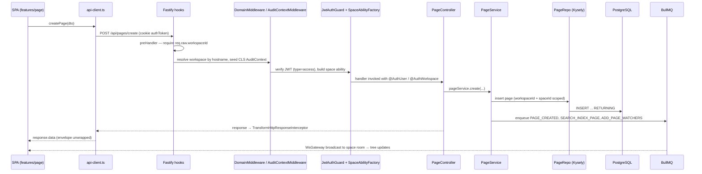

## Data Flow & Integrations

Data enters `boltplan` through four doors and leaves through three.

**In:** (1) HTTP requests to `/api/*` from the SPA and from API-key/OAuth clients; (2) Yjs update messages over the collaboration WebSocket; (3) socket.io events for tree/presence/notification subscriptions; (4) background inputs — imports (Confluence/Notion/Markdown/DOCX zips), SCIM provisioning calls, Stripe webhooks, and MCP tool invocations.

**Out:** (1) HTTP responses, uniformly wrapped by `TransformHttpResponseInterceptor` unless the handler opts out with `@SkipTransform()`; (2) real-time broadcasts (Yjs awareness/updates, socket.io room events); (3) outbound side effects — email, object storage, AI provider calls, SIEM/ClickHouse event export, Stripe, telemetry — all queued through BullMQ and, when the URL is user-supplied, funnelled through `OutboundUrlGuard`.

Two stores hold state: **PostgreSQL** is the system of record (pages, spaces, users, permissions, history, embeddings) and **Redis** is load-bearing infrastructure (queues, cache, socket.io pub/sub, collaboration sync) — not an optional cache.

## Module Dependencies

The dependency direction is strict; violating it is the main architectural regression to watch for.

- `apps/client/src/features/*` → `apps/client/src/lib/api-client.ts` → HTTP `/api`. Components never import axios directly; they go through `features/<domain>/services/*-service.ts` and `features/<domain>/queries/*` (TanStack Query hooks).
- `apps/client/src/ee/*` → `apps/client/src/features/*` and `src/ee/entitlement`. Core client code must not import from `ee/`.
- `apps/server/src/core/*` (controllers) → `core/*/services` → `database/repos/*` → Kysely → Postgres. Controllers do not touch repos for business logic beyond authorization lookups (e.g. `PageController` injects `PageRepo` to resolve a page before an ability check).
- `apps/server/src/core/*` → `common/*` (guards, decorators, interceptors, helpers) and → `integrations/*` (storage, mail, queue, export…). Never the reverse.
- `apps/server/src/ee/*` → `core/*`, `database/*`, `integrations/*`. **`core` must never import `ee`** — `EeModule` is loaded by runtime `require` in [app.module.ts:36](../../apps/server/src/app.module.ts#L36) so community builds without `src/ee` still boot.
- `apps/server/src/collaboration/*` → `database/repos/page`, `core/auth` (token verification), `integrations/queue`, `integrations/redis`. It also imports `collaboration.util.ts` / `yjs.util.ts`, which are the sanctioned bridge between Yjs state and stored ProseMirror JSON.
- `apps/server/src/ws/*` → `core/auth/services/token.service`, `database/repos/space/space-member.repo`, plus `base-realtime.bridge.ts` for EE Bases events.
- Both apps → `packages/editor-ext` (Tiptap schema + docx serializer) and `packages/base-formula` (formula engine, with separate `index.server.ts` / `index.client.ts` entries). These two packages are the only genuinely shared code; DTOs and client types are deliberately duplicated.
- `apps/server/src/database/types/db.d.ts` is generated (`migration:codegen`) and consumed by `entity.types.ts`; nothing should edit it by hand.

## Service Layer

Server-side services, grouped by concern (each is a NestJS `@Injectable` injected into controllers or processors):

- **Domain services** — `apps/server/src/core/page/services/{page.service.ts,page-history.service.ts,backlink.service.ts}`, `core/space/services/space.service.ts`, `core/workspace/services/*`, `core/auth/services/{auth.service.ts,token.service.ts,signup.service.ts}`, `core/comment`, `core/attachment/services/*`, `core/notification/services/*`, `core/group/services/*`, `core/favorite/services/*`, `core/search`, `core/share`, `core/public-space`, `core/label`, `core/watcher`, `core/session`, `core/page/page-access/page-access.service.ts`, `core/page/transclusion/*`.
- **Authorization** — `core/casl/abilities/space-ability.factory.ts` (`SpaceAbilityFactory`) plus `SpaceCaslAction`/`SpaceCaslSubject` in [core/casl/interfaces/space-ability.type.ts](../../apps/server/src/core/casl/interfaces/space-ability.type.ts).
- **Integration facades** — [`StorageService`](../../apps/server/src/integrations/storage/storage.service.ts#L7) (local/S3/Azure), [`MailService`](../../apps/server/src/integrations/mail/mail.service.ts#L12) (SMTP/Postmark), `integrations/export/*` (HTML, Markdown, DOCX, PDF via Gotenberg), `integrations/import/services/*`, `integrations/encryption/encryption.service.ts`, `integrations/environment/environment.service.ts` (single source of config truth), `integrations/telemetry/telemetry.service.ts`, `integrations/security/version.service.ts`, `integrations/outbound/{outbound-url.guard.ts,outbound-agent.factory.ts}`.
- **Realtime** — [`CollaborationGateway`](../../apps/server/src/collaboration/collaboration.gateway.ts#L31), `collaboration/collaboration.handler.ts`, `collaboration/services/collab-history.service.ts`, [`WsGateway`](../../apps/server/src/ws/ws.gateway.ts#L24), `ws/ws.service.ts`, `ws/ws-tree.service.ts`, `ws/base-realtime.bridge.ts`.
- **Enterprise services** — `ee/ai/embeddings/*`, `ee/ai-chat/ai-chat.service.ts`, `ee/api-key/api-key.service.ts`, `ee/audit/*`, `ee/base/base.service.ts`, `ee/mcp/mcp.service.ts`, `ee/mfa/mfa.service.ts`, `ee/page-verification/*`, `ee/scim/scim.service.ts`, `ee/security/sso.service.ts`, `ee/template/*`.
- **Client services** — `apps/client/src/features/<domain>/services/<domain>-service.ts` (thin axios wrappers returning typed payloads) and `apps/client/src/ee/<domain>/services/*`.

## High-level Flow

### 1. Authenticated REST write (create a page)

Every `/api` route (except the short allowlist in `main.ts` and `CoreModule`'s `excludedRoutes`) is rejected before the handler if no workspace resolved, so tenant scoping is structural rather than per-query discipline.

### 2. Collaborative editing (page content)

While a page is open, the Yjs document is authoritative:

1. The client requests a short-lived collab token (`/api/auth/collab-token`, JWT `type: collab`) and opens a WebSocket to Hocuspocus.
2. `collaboration/extensions/authentication.extension.ts` validates the token and the user's space/page access.
3. Updates propagate peer-to-peer through the server; with multiple replicas, `extensions/redis-sync/*` relays them via Redis so any pod can serve any document.
4. `extensions/persistence.extension.ts` debounces snapshots back to Postgres (`pages.ycontent` + ProseMirror JSON), converting through `collaboration.util.ts` / `yjs.util.ts`.
5. `HISTORY_QUEUE` → `collaboration/processors/history.processor.ts` writes page versions; `SEARCH_QUEUE` reindexes content; `AI_QUEUE` recomputes embeddings when AI search is enabled.

Consequence: any REST path that rewrites page content must go through the collaboration utilities, or concurrent editors will silently overwrite it.

### 3. Background work

`integrations/queue` registers twelve BullMQ queues (`integrations/queue/constants/queue.constants.ts`), all Redis-hash-tagged for cluster safety: `EMAIL_QUEUE`, `ATTACHMENT_QUEUE`, `GENERAL_QUEUE`, `BILLING_QUEUE`, `FILE_TASK_QUEUE`, `SEARCH_QUEUE`, `AI_QUEUE`, `HISTORY_QUEUE`, `NOTIFICATION_QUEUE`, `AUDIT_QUEUE`, `BASE_QUEUE`, `SIEM_QUEUE`. Representative jobs: `SEND_EMAIL`, `IMPORT_TASK`/`EXPORT_TASK`, `SEARCH_INDEX_PAGE(S)`/`SEARCH_REMOVE_PAGE`/`TYPESENSE_FLUSH`, `PAGE_CREATED`/`PAGE_CONTENT_UPDATED`/`PAGE_MOVED_TO_SPACE`/`PAGE_SOFT_DELETED`/`PAGE_RESTORED`, `SPACE_*`, `DELETE_PAGE_ATTACHMENTS`/`DELETE_SPACE_ATTACHMENTS`/`DELETE_USER_AVATARS`, `PAGE_BACKLINKS`, `ADD_PAGE_WATCHERS`, `STRIPE_SEATS_SYNC`, `TRIAL_ENDED`, `WELCOME_EMAIL`. Processors live in `integrations/queue/processors/` (`general-queue.processor.ts`, `ai-queue.processor.ts`, and siblings).

### 4. File upload / download

Upload → `@fastify/multipart` → `AttachmentController` → `StorageService` (driver from `STORAGE_DRIVER`) → metadata row via `AttachmentRepo`. Download → signed short-lived JWT (`type: attachment`) → `/api/files/...`, which sets its own CSP and is deliberately excluded from the global frame-header hook in `main.ts`. Attachment text extraction (`ATTACHMENT_INDEX_CONTENT`, via `mammoth`/`@docmost/pdf-inspector`) feeds search and AI indexing.

## Internal Movement

- **Request-scoped context** — `ClsModule` carries the `AuditContext` (`workspaceId`, `actorId`, `actorType: user|system|api_key`, `ipAddress`, `userAgent`) seeded by [audit-context.middleware.ts](../../apps/server/src/common/middlewares/audit-context.middleware.ts); `AuditActorInterceptor` (a global `APP_INTERCEPTOR`) fills in the actor after authentication. Audit writers read from CLS instead of threading parameters.
- **Events** — `@nestjs/event-emitter` handles in-process fan-out (`common/events/event.contants.ts`, `common/events/audit-events.ts` with `AuditEvent`/`AuditResource`/`ActorType`); durable fan-out goes to BullMQ.
- **Cache** — `@nestjs/cache-manager` over `@keyv/redis` with a 5 s default TTL; keys are centralized in `common/helpers/cache-keys.ts` and wrapped by `common/helpers/with-cache.ts`.
- **Websocket rooms** — `ws/ws.utils.ts` derives room names (`getSpaceRoomName`, `getUserRoomName`); on connect, `WsGateway` reads the `authToken` cookie, verifies the access JWT, and joins the user to every space they belong to (`SpaceMemberRepo.getUserSpaceIds`). `WsRedisIoAdapter` makes those rooms work across replicas.
- **Database listeners** — `database/listeners/*` react to persistence-level changes; pagination is standardized through `database/pagination/pagination-options.ts` so every list endpoint takes the same shape.
- **Cross-process** — the optional standalone collab server shares only Postgres and Redis with the API process; there is no direct RPC between them.

## External Integrations

- **PostgreSQL** (`DATABASE_URL`, `DATABASE_MAX_POOL`) — system of record. Extensions: `pgvector` (page embeddings), trigram/tsvector indexes for search. Migrations are forward-only files in `database/migrations` applied by `migration:latest`.
- **Redis** (`REDIS_URL`) — queues, cache, socket.io adapter, collab sync. `COLLAB_DISABLE_REDIS` exists for single-node setups. Compose pins `--maxmemory-policy noeviction` because eviction would drop queue state.
- **Object storage** — `STORAGE_DRIVER=local|s3|azure`. S3 uses `@aws-sdk/client-s3` + `lib-storage` + presigner (`AWS_S3_*`, incl. `AWS_S3_FORCE_PATH_STYLE`); Azure uses `@azure/storage-blob` (`AZURE_STORAGE_*`). Failures surface as upload errors; no retry queue for the upload itself.
- **Mail** — `MAIL_DRIVER=smtp|postmark`. Payloads are React Email templates from `integrations/transactional/emails`, rendered server-side and enqueued on `EMAIL_QUEUE` (BullMQ supplies the retry/backoff). `MAIL_BLOCKED_RECIPIENT_DOMAINS` filters recipients.
- **Gotenberg** (`GOTENBERG_URL`) — server-side PDF rendering; the server mints a `pdf_render` JWT so Gotenberg can fetch the page, and a `pdf_export_download` JWT for the resulting file task.
- **Draw.io** (`DRAWIO_URL`) — embedded diagram editor, loaded in an iframe by the client.
- **AI providers (EE)** — `AI_DRIVER` selects OpenAI / Google / OpenAI-compatible / Ollama (`OPENAI_API_KEY`, `OPENAI_API_URL`, `GEMINI_API_KEY`, `OLLAMA_API_URL`); models and dimensions are configured separately for embedding/completion/chat. Vector storage is Postgres+pgvector or Turbopuffer (`AI_VECTOR_DRIVER`, `TURBOPUFFER_*`). Work is queued on `AI_QUEUE`; token accounting uses `js-tiktoken`.
- **Search drivers** — `SEARCH_DRIVER`: Postgres full-text by default, optional Typesense (`TYPESENSE_URL`, `TYPESENSE_API_KEY`, `TYPESENSE_LOCALE`) with a `TYPESENSE_FLUSH` job.
- **Identity providers (EE)** — SAML (`@node-saml/passport-saml`, `SAML_DISABLE_REQUESTED_AUTHN_CONTEXT`), OIDC (`openid-client`), LDAP (`ldapts`), Google OAuth (`passport-google-oauth20`), SCIM 2.0 (`scimmy`, patched — see `patches/scimmy@1.3.5.patch`; the server registers an `application/scim+json` content-type parser in `main.ts`).
- **OAuth provider** — `@jmondi/oauth2-server` exposes `.well-known/oauth-authorization-server` and `.well-known/oauth-protected-resource(/mcp)`; access tokens are JWTs with `type: oauth_access`, `scope`, `grantId`. `@OAuthScope()` marks scope requirements on controllers.
- **MCP (EE)** — `@modelcontextprotocol/sdk` serves the unprefixed `/mcp` route so AI agents can read/write pages using API keys or OAuth grants.
- **Stripe (EE cloud)** — subscriptions and seat sync (`STRIPE_SECRET_KEY`, `STRIPE_WEBHOOK_SECRET`). `/api/billing/stripe/webhook` is exempt from tenant resolution *and* from `DomainMiddleware`, and must verify the Stripe signature itself.
- **ClickHouse / SIEM (EE)** — `EVENT_STORE_DRIVER`, `CLICKHOUSE_URL`, and `siem_destinations` rows; export runs on `SIEM_QUEUE` and destination URLs go through `OutboundUrlGuard`.
- **Telemetry** — anonymous usage ping unless `DISABLE_TELEMETRY=true`; the client optionally reports to PostHog (`POSTHOG_HOST`, `POSTHOG_KEY`).
- **Crowdin** — translation sync (`crowdin.yml`); locale JSON is fetched at runtime by `i18next-http-backend`.

Every outbound request built from user input (embeds, imports by URL, SIEM destinations, webhooks, AI base URLs) must be constructed through [`OutboundUrlGuard`](../../apps/server/src/integrations/outbound/outbound-url.guard.ts#L144) / `OutboundAgentFactory`, which reject private address ranges unless explicitly allowed via `ALLOWED_PRIVATE_NETWORKS`. That is the single SSRF chokepoint — see [security.md](security.md).

## Observability & Failure Modes

**Logging.** `nestjs-pino` with `pino-http`; `InternalLogFilter` captures Nest's own bootstrap errors. `DEBUG_MODE=true` enables debug logs in production, `DEBUG_DB=true` logs SQL, `LOG_HTTP=true` logs requests. `pino-pretty` is used in development. `main.ts` installs `unhandledRejection` and `uncaughtException` handlers that log rather than crash, so a silent replica is a real possibility — watch the logs, not just liveness.

**Health.** `@nestjs/terminus` exposes `/api/health` (Postgres + Redis indicators in `integrations/health/{postgres,redis}.health.ts`) and `/api/health/live`; both bypass tenant resolution.

**Retries and backpressure.** BullMQ owns retry/backoff for every queued side effect; failed jobs stay inspectable in Redis. There is no configured dead-letter queue, so repeated failures accumulate as failed jobs — check queue depth when email or search lag. Rate limiting is `@nestjs/throttler` backed by Redis (`UserThrottlerGuard` keys by user), so a Redis outage degrades throttling too.

**Known failure modes.**
- *Redis down* → queues, websockets, collaboration sync, cache, and throttling all fail together. The app is not usable in a meaningful sense; treat Redis as tier-0.
- *Redis eviction* → silent job loss. Keep `noeviction`.
- *Postgres pool exhaustion* → requests hang rather than fail fast; `DATABASE_MAX_POOL` plus long-running export/import jobs are the usual cause.
- *Collab/API split-brain* → if the standalone collab process runs against a different Redis or has `COLLAB_DISABLE_REDIS` set inconsistently, edits appear to save but do not propagate.
- *Stale envelope assumptions* → forgetting `@SkipTransform()` on a download endpoint breaks the client, since `api-client.ts` unwraps `response.data` for everything except the four exempt export paths.
- *Outbound guard bypass* → any `fetch`/`axios` call built directly from user input is an SSRF hole; route it through `OutboundAgentFactory`.

## Related Resources

- [architecture.md](architecture.md) — layers, patterns, and boundaries
- [project-overview.md](project-overview.md) — stack and orientation
- [security.md](security.md) — tokens, tenancy, SSRF, secrets
- [glossary.md](glossary.md) — entities and enums referenced above
- [development-workflow.md](development-workflow.md) — running migrations and services locally
