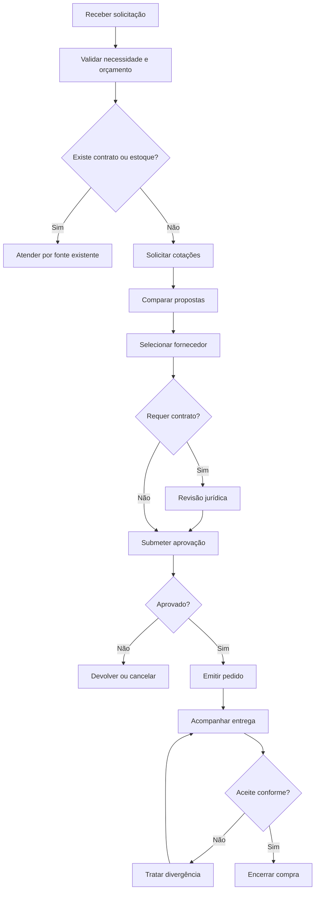

# SOP — Solicitação de Compras

| Campo | Informação |
| --- | --- |
| **Código** | SOP-COM-001 |
| **Versão** | 1.0 |
| **Status** | Aprovado / Em revisão |
| **Área** | Compras |
| **Proprietário do Processo** | Coordenação de Compras |
| **Aprovador** | Gestor do centro de custo / Diretoria, conforme alçada |
| **Periodicidade de Revisão** | Anual ou após mudança relevante |
| **Classificação** | Uso interno |

## 1. Objetivo

Padronizar a aquisição de produtos e serviços, garantindo necessidade justificada, competitividade, aprovação, rastreabilidade e conformidade.

## 2. Escopo

### Inclui
- Compras de materiais, equipamentos, licenças e serviços.
- Renovações contratuais que exijam processo de compra.
- Contratações pontuais e recorrentes.

### Não inclui
- Despesas realizadas por cartão corporativo dentro de política própria.
- Contratações de pessoal.

## 3. Entradas

| Entrada | Origem | Obrigatória |
| --- | --- | --- |
| Solicitação de compra | Área requisitante | Sim |
| Especificação técnica | Área requisitante | Sim |
| Centro de custo / orçamento | Gestor | Sim |
| Cotação ou referência de preço | Compras | Sim |

## 4. Saídas

| Saída | Destino | Evidência |
| --- | --- | --- |
| Pedido de compra aprovado | Fornecedor | PO / pedido |
| Contrato, quando aplicável | Jurídico / área | Contrato assinado |
| Registro de seleção | Compras | Mapa de cotação |

## 5. Papéis e Responsabilidades — RACI

**Legenda:** R = executa; A = responsável final; C = consultado; I = informado.

| Atividade | Solicitante | Executor | Gestor | Especialista/Owner |
| --- | --- | --- | --- | --- |
| Abrir solicitação | R | C | A | I |
| Realizar cotações | C | R | I | I |
| Selecionar fornecedor | C | R | A | C |
| Aprovar compra | I | C | R/A | I |
| Emitir pedido | I | R | I | I |

## 6. Fluxograma

## 7. Procedimento Detalhado

1. Receber a solicitação com justificativa, especificação, quantidade, prazo e centro de custo.
2. Validar se a necessidade pode ser atendida por estoque, contrato vigente ou fornecedor homologado existente.
3. Confirmar disponibilidade orçamentária.
4. Definir estratégia de compra e quantidade mínima de cotações.
5. Solicitar propostas comparáveis e registrar condições comerciais.
6. Avaliar preço, prazo, qualidade, requisitos técnicos, riscos e histórico do fornecedor.
7. Submeter a recomendação para aprovação conforme alçada.
8. Encaminhar para revisão jurídica quando houver contrato.
9. Emitir pedido de compra ou formalizar contratação.
10. Acompanhar entrega e aceite, registrando desvios.

## 8. Regras de Negócio

| ID | Regra |
| --- | --- |
| RN-01 | Compras acima do limite definido exigem múltiplas cotações, salvo justificativa de fornecedor exclusivo. |
| RN-02 | A área requisitante não deve aprovar isoladamente sua própria compra quando houver exigência de segregação. |
| RN-03 | Fornecedor deve estar homologado antes da emissão do pedido, salvo exceção aprovada. |
| RN-04 | Mudanças relevantes de escopo exigem nova validação de preço e aprovação. |

## 9. Exceções e Tratamento

| Exceção | Tratamento |
| --- | --- |
| Fornecedor exclusivo | Documentar justificativa técnica/comercial e obter aprovação. |
| Compra emergencial | Registrar motivo, risco e aprovação excepcional. |
| Orçamento insuficiente | Retornar ao gestor para repriorização. |
| Entrega divergente | Suspender aceite e acionar fornecedor. |

## 10. SLA e Prazos

| Atividade | Prazo |
| --- | --- |
| Triagem da solicitação | 1 dia útil |
| Cotação padrão | Até 3 dias úteis |
| Compra complexa | Conforme plano de contratação |
| Tratamento de divergência | Até 1 dia útil após identificação |

## 11. Riscos e Controles

| ID | Risco | Probabilidade | Impacto | Controle |
| --- | --- | --- | --- | --- |
| R01 | Compra sem competitividade | Média | Médio | Mapa de cotação |
| R02 | Fornecedor inadequado | Média | Alto | Homologação e avaliação |
| R03 | Compra fora do orçamento | Baixa | Alto | Validação de centro de custo |
| R04 | Conflito de interesse | Baixa | Crítico | Segregação e declaração de conflito |

## 12. Evidências Obrigatórias

- [ ] Solicitação aprovada
- [ ] Cotações
- [ ] Mapa comparativo
- [ ] Aprovação
- [ ] Pedido de compra
- [ ] Contrato
- [ ] Comprovante de aceite

## 13. Indicadores — KPIs

| Indicador | Cálculo | Meta |
| --- | --- | --- |
| Lead time de compra | Data do pedido - data da solicitação | Conforme categoria |
| Compras emergenciais | Compras emergenciais / total | ≤ 5% |
| Saving negociado | Preço referência - preço contratado | Acompanhar mensalmente |
| Entregas no prazo | Entregas no prazo / total | ≥ 95% |

## 14. Checklist Operacional

### Antes
- [ ] Entradas obrigatórias recebidas
- [ ] Responsáveis identificados
- [ ] Aprovações necessárias confirmadas
- [ ] Riscos relevantes avaliados

### Durante
- [ ] Etapas executadas na ordem prevista
- [ ] Desvios registrados
- [ ] Evidências coletadas
- [ ] Comunicações realizadas

### Depois
- [ ] Resultado validado
- [ ] Pendências atribuídas
- [ ] Evidências arquivadas
- [ ] Processo encerrado no sistema

## 15. Auditoria

A execução deve permitir identificar, no mínimo:

- quem solicitou;
- quem aprovou;
- quem executou;
- data e hora das principais etapas;
- desvios ou exceções;
- evidências produzidas;
- resultado final.

## 16. Histórico de Revisões

| Versão | Data | Autor | Alteração |
|---|---|---|---|
| 1.0 | {Data} | {Autor} | Criação do procedimento detalhado |

## 17. Aprovação

| Papel | Nome | Data | Status |
|---|---|---|---|
| Elaborado por | {Nome} | {Data} | {Status} |
| Revisado por | {Nome} | {Data} | {Status} |
| Aprovado por | {Nome} | {Data} | {Status} |
