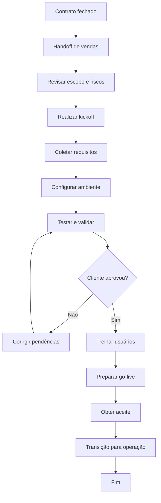

# SOP — Onboarding de Cliente

| Campo | Informação |
| --- | --- |
| **Código** | SOP-CS-001 |
| **Versão** | 1.0 |
| **Status** | Aprovado / Em revisão |
| **Área** | Customer Success |
| **Proprietário do Processo** | Customer Success |
| **Aprovador** | Gestor de CS / responsável pela implantação |
| **Periodicidade de Revisão** | Anual ou após mudança relevante |
| **Classificação** | Uso interno |

## 1. Objetivo

Conduzir o cliente da assinatura do contrato ao uso efetivo da solução, com escopo, responsabilidades, prazos e critérios de sucesso claros.

## 2. Escopo

### Inclui
- Clientes novos.
- Expansões que exijam nova implantação.
- Configuração, integrações, treinamento e aceite.

### Não inclui
- Suporte contínuo após transição para operação normal.
- Mudanças de escopo não previstas no contrato.

## 3. Entradas

| Entrada | Origem | Obrigatória |
| --- | --- | --- |
| Contrato e escopo | Vendas / Jurídico | Sim |
| Handoff comercial | Vendas | Sim |
| Contatos e stakeholders | Cliente | Sim |
| Requisitos técnicos | Cliente / Produto | Quando aplicável |

## 4. Saídas

| Saída | Destino | Evidência |
| --- | --- | --- |
| Plano de onboarding | Cliente / CS | Plano aprovado |
| Ambiente configurado | Cliente | Checklist técnico |
| Treinamento realizado | Usuários | Registro |
| Aceite / go-live | Cliente | Aceite formal |

## 5. Papéis e Responsabilidades — RACI

**Legenda:** R = executa; A = responsável final; C = consultado; I = informado.

| Atividade | Solicitante | Executor | Gestor | Especialista/Owner |
| --- | --- | --- | --- | --- |
| Handoff comercial | R | C | A | I |
| Kickoff | C | R | A | C |
| Configuração técnica | I | C | A | R |
| Treinamento | I | R | A | C |
| Aceite | I | R | C | A |

## 6. Fluxograma

## 7. Procedimento Detalhado

1. Receber handoff de vendas e revisar escopo, compromissos, riscos e expectativas.
2. Validar stakeholders, patrocinador, usuários-chave e contatos técnicos.
3. Realizar kickoff com objetivos, cronograma, responsabilidades e critérios de sucesso.
4. Coletar dados, acessos e requisitos necessários à configuração.
5. Configurar ambiente, integrações e parâmetros conforme escopo.
6. Executar testes internos e validação com cliente.
7. Realizar treinamento administrativo e operacional.
8. Preparar go-live e plano de suporte inicial.
9. Obter aceite dos critérios de sucesso.
10. Realizar transição para Customer Success contínuo e registrar aprendizados.

## 8. Regras de Negócio

| ID | Regra |
| --- | --- |
| RN-01 | Mudanças de escopo devem ser formalmente avaliadas antes da execução. |
| RN-02 | Critérios de sucesso devem ser definidos no início do onboarding. |
| RN-03 | Pendências do cliente devem ter owner e prazo registrados. |
| RN-04 | Go-live não deve ocorrer com risco crítico aberto sem aceite formal. |

## 9. Exceções e Tratamento

| Exceção | Tratamento |
| --- | --- |
| Cliente sem disponibilidade | Replanejar cronograma e registrar impacto. |
| Integração externa atrasada | Criar plano alternativo e escalonar dependência. |
| Mudança de escopo | Encaminhar para análise comercial/técnica. |

## 10. SLA e Prazos

| Atividade | Prazo |
| --- | --- |
| Handoff | Até 1 dia útil após fechamento |
| Kickoff | Até 5 dias úteis, salvo acordo diferente |
| Resposta a pendência crítica | 1 dia útil |
| Transição pós go-live | Até 5 dias úteis após aceite |

## 11. Riscos e Controles

| ID | Risco | Probabilidade | Impacto | Controle |
| --- | --- | --- | --- | --- |
| R01 | Expectativa desalinhada | Média | Alto | Kickoff e critérios de sucesso |
| R02 | Dependência do cliente | Alta | Médio | Plano de pendências |
| R03 | Go-live incompleto | Média | Alto | Checklist de prontidão |
| R04 | Escopo não controlado | Média | Alto | Gestão formal de mudança |

## 12. Evidências Obrigatórias

- [ ] Handoff
- [ ] Ata de kickoff
- [ ] Plano de onboarding
- [ ] Checklist técnico
- [ ] Treinamentos
- [ ] Aceite

## 13. Indicadores — KPIs

| Indicador | Cálculo | Meta |
| --- | --- | --- |
| Tempo até go-live | Data go-live - data fechamento | Conforme segmento |
| Onboardings no prazo | Concluídos no prazo / total | ≥ 90% |
| Adoção inicial | Usuários ativos / usuários previstos | Meta por produto |
| Satisfação do onboarding | Média de pesquisa | ≥ 4,5/5 |

## 14. Checklist Operacional

### Antes
- [ ] Entradas obrigatórias recebidas
- [ ] Responsáveis identificados
- [ ] Aprovações necessárias confirmadas
- [ ] Riscos relevantes avaliados

### Durante
- [ ] Etapas executadas na ordem prevista
- [ ] Desvios registrados
- [ ] Evidências coletadas
- [ ] Comunicações realizadas

### Depois
- [ ] Resultado validado
- [ ] Pendências atribuídas
- [ ] Evidências arquivadas
- [ ] Processo encerrado no sistema

## 15. Auditoria

A execução deve permitir identificar, no mínimo:

- quem solicitou;
- quem aprovou;
- quem executou;
- data e hora das principais etapas;
- desvios ou exceções;
- evidências produzidas;
- resultado final.

## 16. Histórico de Revisões

| Versão | Data | Autor | Alteração |
|---|---|---|---|
| 1.0 | {Data} | {Autor} | Criação do procedimento detalhado |

## 17. Aprovação

| Papel | Nome | Data | Status |
|---|---|---|---|
| Elaborado por | {Nome} | {Data} | {Status} |
| Revisado por | {Nome} | {Data} | {Status} |
| Aprovado por | {Nome} | {Data} | {Status} |
