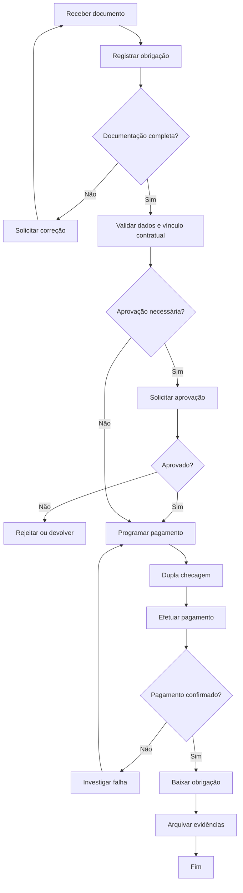

# SOP — Contas a Pagar

| Campo | Informação |
| --- | --- |
| **Código** | SOP-FIN-001 |
| **Versão** | 1.0 |
| **Status** | Aprovado / Em revisão |
| **Área** | Financeiro |
| **Proprietário do Processo** | Coordenação Financeira |
| **Aprovador** | Gerência Financeira / Diretoria, conforme alçada |
| **Periodicidade de Revisão** | Anual ou após mudança relevante |
| **Classificação** | Uso interno |

## 1. Objetivo

Garantir que obrigações financeiras sejam registradas, validadas, aprovadas e pagas corretamente, no prazo e com rastreabilidade.

## 2. Escopo

### Inclui
- Pagamentos a fornecedores, prestadores, concessionárias e demais terceiros.
- Despesas recorrentes e não recorrentes.
- Pagamentos vinculados a contratos, pedidos de compra e notas fiscais.

### Não inclui
- Folha de pagamento, quando tratada em processo específico.
- Adiantamentos sem documento hábil, salvo exceção formalmente aprovada.

## 3. Entradas

| Entrada | Origem | Obrigatória |
| --- | --- | --- |
| Nota fiscal / fatura / boleto | Fornecedor / área solicitante | Sim |
| Pedido de compra ou contrato | Compras / Jurídico | Quando aplicável |
| Aprovação da despesa | Gestor responsável | Sim |
| Dados bancários homologados | Cadastro de fornecedor | Sim |

## 4. Saídas

| Saída | Destino | Evidência |
| --- | --- | --- |
| Pagamento efetuado | Fornecedor | Comprovante bancário |
| Obrigação baixada | ERP / controle financeiro | Registro de baixa |
| Documentação arquivada | Financeiro / Auditoria | Dossiê do pagamento |

## 5. Papéis e Responsabilidades — RACI

**Legenda:** R = executa; A = responsável final; C = consultado; I = informado.

| Atividade | Solicitante | Executor | Gestor | Especialista/Owner |
| --- | --- | --- | --- | --- |
| Receber e conferir documento | I | R | C | I |
| Validar orçamento/alçada | C | R | A | I |
| Aprovar pagamento | I | C | R/A | I |
| Executar pagamento | I | R | A | I |
| Arquivar evidências | I | R | C | I |

## 6. Fluxograma

## 7. Procedimento Detalhado

1. Receber a documentação e registrar a obrigação no controle financeiro.
2. Validar CNPJ/CPF, razão social, vencimento, valor, centro de custo e natureza da despesa.
3. Conferir correspondência entre nota fiscal, contrato, pedido de compra e recebimento.
4. Validar dados bancários exclusivamente contra cadastro homologado.
5. Verificar alçada de aprovação e solicitar aprovação quando necessário.
6. Programar o pagamento respeitando vencimento, fluxo de caixa e calendário bancário.
7. Realizar dupla checagem dos dados antes da autorização bancária.
8. Efetuar o pagamento e capturar o comprovante.
9. Baixar a obrigação no sistema e vincular o comprovante.
10. Arquivar as evidências e tratar divergências ou devoluções.

## 8. Regras de Negócio

| ID | Regra |
| --- | --- |
| RN-01 | Nenhum pagamento deve ser realizado sem documento hábil e aprovação exigida pela alçada. |
| RN-02 | Alteração de dados bancários exige validação independente antes do primeiro pagamento. |
| RN-03 | Pagamentos duplicados devem ser bloqueados por conferência de fornecedor, documento, valor e vencimento. |
| RN-04 | Pagamentos emergenciais devem conter justificativa e aprovação excepcional. |

## 9. Exceções e Tratamento

| Exceção | Tratamento |
| --- | --- |
| Documento fiscal inválido | Devolver à área/fornecedor e não programar o pagamento. |
| Divergência de valor | Suspender processamento até reconciliação formal. |
| Fornecedor não homologado | Encaminhar para cadastro/homologação. |
| Pagamento devolvido | Investigar causa, corrigir dados e reprocessar somente após validação. |

## 10. SLA e Prazos

| Atividade | Prazo |
| --- | --- |
| Registro da obrigação | Até 1 dia útil após recebimento completo |
| Validação documental | Até 1 dia útil |
| Programação do pagamento | Antes do vencimento conforme calendário |
| Tratamento de rejeição bancária | Mesmo dia útil da identificação |

## 11. Riscos e Controles

| ID | Risco | Probabilidade | Impacto | Controle |
| --- | --- | --- | --- | --- |
| R01 | Pagamento em duplicidade | Média | Alto | Conferência sistêmica e dupla checagem |
| R02 | Pagamento para conta fraudulenta | Baixa | Crítico | Validação independente de dados bancários |
| R03 | Pagamento em atraso | Média | Médio | Agenda de vencimentos e alertas |
| R04 | Pagamento sem aprovação | Baixa | Alto | Controle de alçada e segregação de funções |

## 12. Evidências Obrigatórias

- [ ] Documento fiscal
- [ ] Pedido/contrato
- [ ] Aprovação
- [ ] Comprovante bancário
- [ ] Registro de baixa
- [ ] Comunicações de exceção

## 13. Indicadores — KPIs

| Indicador | Cálculo | Meta |
| --- | --- | --- |
| Pagamentos no prazo | Pagamentos no prazo / total | ≥ 98% |
| Taxa de retrabalho | Pagamentos devolvidos ou corrigidos / total | ≤ 2% |
| Juros e multas | Valor mensal de encargos por atraso | Tendência decrescente |
| Tempo de aprovação | Tempo médio entre solicitação e aprovação | Conforme alçada |

## 14. Checklist Operacional

### Antes
- [ ] Entradas obrigatórias recebidas
- [ ] Responsáveis identificados
- [ ] Aprovações necessárias confirmadas
- [ ] Riscos relevantes avaliados

### Durante
- [ ] Etapas executadas na ordem prevista
- [ ] Desvios registrados
- [ ] Evidências coletadas
- [ ] Comunicações realizadas

### Depois
- [ ] Resultado validado
- [ ] Pendências atribuídas
- [ ] Evidências arquivadas
- [ ] Processo encerrado no sistema

## 15. Auditoria

A execução deve permitir identificar, no mínimo:

- quem solicitou;
- quem aprovou;
- quem executou;
- data e hora das principais etapas;
- desvios ou exceções;
- evidências produzidas;
- resultado final.

## 16. Histórico de Revisões

| Versão | Data | Autor | Alteração |
|---|---|---|---|
| 1.0 | {Data} | {Autor} | Criação do procedimento detalhado |

## 17. Aprovação

| Papel | Nome | Data | Status |
|---|---|---|---|
| Elaborado por | {Nome} | {Data} | {Status} |
| Revisado por | {Nome} | {Data} | {Status} |
| Aprovado por | {Nome} | {Data} | {Status} |
