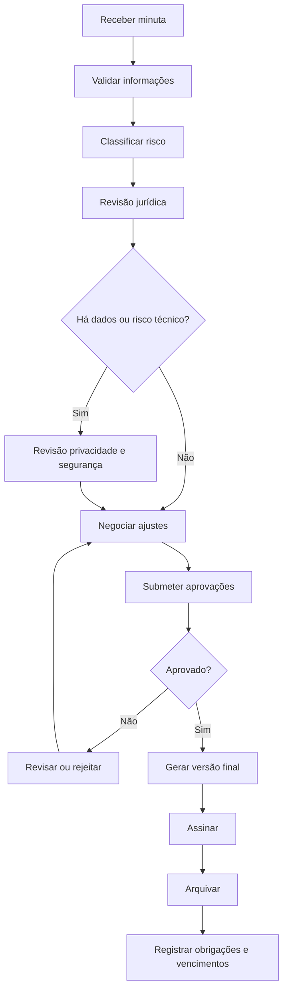

# SOP — Aprovação de Contratos

| Campo | Informação |
| --- | --- |
| **Código** | SOP-JUR-001 |
| **Versão** | 1.0 |
| **Status** | Aprovado / Em revisão |
| **Área** | Jurídico / Compliance |
| **Proprietário do Processo** | Jurídico |
| **Aprovador** | Jurídico + áreas responsáveis conforme matéria |
| **Periodicidade de Revisão** | Anual ou após mudança relevante |
| **Classificação** | Uso interno |

## 1. Objetivo

Garantir que contratos sejam revisados, aprovados, assinados e arquivados com controle de riscos, obrigações, privacidade e vigência.

## 2. Escopo

### Inclui
- Contratos com clientes, fornecedores, parceiros e prestadores.
- Aditivos, renovações e termos relevantes.

### Não inclui
- Documentos padronizados de baixo risco quando cobertos por fluxo simplificado.
- Atos societários tratados em processo próprio.

## 3. Entradas

| Entrada | Origem | Obrigatória |
| --- | --- | --- |
| Minuta contratual | Solicitante / contraparte | Sim |
| Escopo comercial | Área solicitante | Sim |
| Valores e prazo | Área solicitante | Sim |
| Dados das partes | Solicitante | Sim |

## 4. Saídas

| Saída | Destino | Evidência |
| --- | --- | --- |
| Contrato aprovado | Solicitante | Versão final |
| Contrato assinado | Partes | Documento assinado |
| Obrigações registradas | Área responsável | Controle contratual |

## 5. Papéis e Responsabilidades — RACI

**Legenda:** R = executa; A = responsável final; C = consultado; I = informado.

| Atividade | Solicitante | Executor | Gestor | Especialista/Owner |
| --- | --- | --- | --- | --- |
| Solicitar revisão | R | I | A | I |
| Revisar cláusulas | C | R | A | C |
| Aprovar aspectos comerciais | R/A | C | I | I |
| Aprovar privacidade/segurança | C | C | I | R/A |
| Arquivar | I | R | A | I |

## 6. Fluxograma

## 7. Procedimento Detalhado

1. Receber solicitação e validar informações mínimas do negócio.
2. Classificar tipo de contrato, materialidade e nível de risco.
3. Revisar objeto, prazo, preço, responsabilidades, garantias, multas e rescisão.
4. Avaliar cláusulas de confidencialidade, propriedade intelectual e responsabilidade.
5. Acionar Privacidade/Segurança quando houver dados pessoais ou integração tecnológica.
6. Registrar comentários e negociar redação com contraparte.
7. Obter aprovações das áreas competentes conforme alçada.
8. Gerar versão final e encaminhar para assinatura.
9. Validar assinaturas e poderes de representação.
10. Arquivar contrato e registrar vencimento, renovação e obrigações críticas.

## 8. Regras de Negócio

| ID | Regra |
| --- | --- |
| RN-01 | Nenhum contrato deve ser assinado fora da alçada definida. |
| RN-02 | Cláusulas de dados pessoais exigem avaliação quando aplicável. |
| RN-03 | Versões finais devem ser protegidas contra alterações após aprovação. |
| RN-04 | Renovações automáticas devem ser monitoradas antes da janela de denúncia. |

## 9. Exceções e Tratamento

| Exceção | Tratamento |
| --- | --- |
| Contrato padrão aprovado | Aplicar revisão simplificada conforme política. |
| Assinatura urgente | Exigir justificativa e alçada excepcional. |
| Contraparte recusa cláusula crítica | Escalar risco para decisão executiva. |

## 10. SLA e Prazos

| Atividade | Prazo |
| --- | --- |
| Triagem | 1 dia útil |
| Contrato padrão | Até 3 dias úteis |
| Contrato complexo | Conforme complexidade e negociação |
| Renovação | Iniciar revisão antes da janela contratual |

## 11. Riscos e Controles

| ID | Risco | Probabilidade | Impacto | Controle |
| --- | --- | --- | --- | --- |
| R01 | Assunção de obrigação excessiva | Média | Alto | Revisão jurídica |
| R02 | Renovação indesejada | Média | Médio | Controle de vencimentos |
| R03 | Tratamento inadequado de dados | Baixa | Crítico | Revisão de privacidade |
| R04 | Assinatura sem poderes | Baixa | Alto | Validação de representação |

## 12. Evidências Obrigatórias

- [ ] Minuta inicial
- [ ] Comentários
- [ ] Aprovações
- [ ] Versão final
- [ ] Assinaturas
- [ ] Cadastro de obrigações

## 13. Indicadores — KPIs

| Indicador | Cálculo | Meta |
| --- | --- | --- |
| Tempo de ciclo | Assinatura - abertura | Meta por categoria |
| Contratos vencidos sem ação | Quantidade | 0 |
| Renovações tratadas no prazo | Renovações no prazo / total | 100% |
| Contratos com exceção | Exceções / total | Monitorar tendência |

## 14. Checklist Operacional

### Antes
- [ ] Entradas obrigatórias recebidas
- [ ] Responsáveis identificados
- [ ] Aprovações necessárias confirmadas
- [ ] Riscos relevantes avaliados

### Durante
- [ ] Etapas executadas na ordem prevista
- [ ] Desvios registrados
- [ ] Evidências coletadas
- [ ] Comunicações realizadas

### Depois
- [ ] Resultado validado
- [ ] Pendências atribuídas
- [ ] Evidências arquivadas
- [ ] Processo encerrado no sistema

## 15. Auditoria

A execução deve permitir identificar, no mínimo:

- quem solicitou;
- quem aprovou;
- quem executou;
- data e hora das principais etapas;
- desvios ou exceções;
- evidências produzidas;
- resultado final.

## 16. Histórico de Revisões

| Versão | Data | Autor | Alteração |
|---|---|---|---|
| 1.0 | {Data} | {Autor} | Criação do procedimento detalhado |

## 17. Aprovação

| Papel | Nome | Data | Status |
|---|---|---|---|
| Elaborado por | {Nome} | {Data} | {Status} |
| Revisado por | {Nome} | {Data} | {Status} |
| Aprovado por | {Nome} | {Data} | {Status} |
