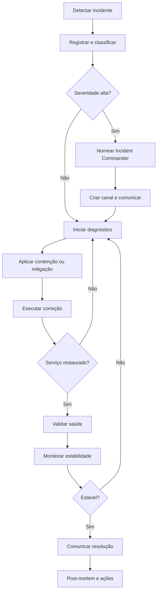

# SOP — Gestão de Incidentes

| Campo | Informação |
| --- | --- |
| **Código** | SOP-OPS-001 |
| **Versão** | 1.0 |
| **Status** | Aprovado / Em revisão |
| **Área** | Operações / TI |
| **Proprietário do Processo** | Gestão de Operações |
| **Aprovador** | Incident Manager / Gestor de Operações |
| **Periodicidade de Revisão** | Anual ou após mudança relevante |
| **Classificação** | Uso interno |

## 1. Objetivo

Restaurar serviços afetados rapidamente, coordenando resposta, comunicação, mitigação, recuperação e aprendizado.

## 2. Escopo

### Inclui
- Incidentes operacionais e tecnológicos.
- Eventos que afetem disponibilidade, integridade ou desempenho de serviços.

### Não inclui
- Problemas sem impacto imediato tratados por Problem Management.
- Mudanças planejadas sem incidente.

## 3. Entradas

| Entrada | Origem | Obrigatória |
| --- | --- | --- |
| Alerta ou ticket | Monitoramento / usuário | Sim |
| Serviço afetado | Operações | Sim |
| Impacto | Operações / negócio | Sim |
| Evidências técnicas | Monitoramento / times | Quando disponível |

## 4. Saídas

| Saída | Destino | Evidência |
| --- | --- | --- |
| Serviço restaurado | Usuários / negócio | Métricas |
| Comunicação final | Stakeholders | Mensagem |
| Registro do incidente | Operações | Timeline |
| Post-mortem | Engenharia / negócio | Quando aplicável |

## 5. Papéis e Responsabilidades — RACI

**Legenda:** R = executa; A = responsável final; C = consultado; I = informado.

| Atividade | Solicitante | Executor | Gestor | Especialista/Owner |
| --- | --- | --- | --- | --- |
| Detectar e registrar | R | C | A | I |
| Classificar severidade | R | C | A | I |
| Coordenar resposta | C | R | A | I |
| Comunicar stakeholders | C | R | A | I |
| Executar correção | C | R | A | I |

## 6. Fluxograma

## 7. Procedimento Detalhado

1. Detectar ou receber relato e abrir registro imediatamente.
2. Identificar serviços, clientes, regiões e funcionalidades afetadas.
3. Classificar severidade com base em impacto e urgência.
4. Nomear Incident Commander para incidentes relevantes.
5. Criar canal de coordenação e definir cadência de comunicação.
6. Conter impacto e aplicar mitigação segura.
7. Investigar hipóteses em paralelo, preservando evidências.
8. Restaurar serviço e validar indicadores de saúde.
9. Monitorar estabilidade por período definido.
10. Comunicar resolução e registrar timeline.
11. Abrir ações corretivas e realizar post-mortem sem culpabilização quando aplicável.

## 8. Regras de Negócio

| ID | Regra |
| --- | --- |
| RN-01 | Restauração do serviço tem prioridade sobre investigação de causa raiz durante incidente ativo. |
| RN-02 | Mudanças emergenciais devem ser registradas e revisadas posteriormente. |
| RN-03 | Comunicações devem informar impacto, status e próxima atualização. |
| RN-04 | Post-mortem deve focar melhoria sistêmica, não culpabilização individual. |

## 9. Exceções e Tratamento

| Exceção | Tratamento |
| --- | --- |
| Incidente de segurança | Acionar simultaneamente resposta a incidentes de segurança. |
| Fornecedor externo | Acionar canal de escalonamento do fornecedor. |
| Sem causa identificada | Encerrar incidente apenas após estabilidade e abrir Problem Management. |

## 10. SLA e Prazos

| Atividade | Prazo |
| --- | --- |
| SEV1 - mobilização | Até 10 minutos |
| SEV1 - atualização | A cada 30 minutos ou menos |
| SEV2 - mobilização | Até 30 minutos |
| Post-mortem | Até 5 dias úteis após incidente relevante |

## 11. Riscos e Controles

| ID | Risco | Probabilidade | Impacto | Controle |
| --- | --- | --- | --- | --- |
| R01 | Ação agravar incidente | Média | Crítico | Mudanças controladas e rollback |
| R02 | Comunicação insuficiente | Média | Alto | Cadência definida |
| R03 | Perda de evidência | Baixa | Alto | Preservação de logs |
| R04 | Recorrência | Média | Alto | Ações corretivas rastreadas |

## 12. Evidências Obrigatórias

- [ ] Registro do incidente
- [ ] Timeline
- [ ] Logs
- [ ] Comunicações
- [ ] Mudanças realizadas
- [ ] Post-mortem
- [ ] Ações corretivas

## 13. Indicadores — KPIs

| Indicador | Cálculo | Meta |
| --- | --- | --- |
| MTTA | Tempo médio até reconhecimento | Meta por severidade |
| MTTR | Tempo médio até restauração | Meta por serviço |
| Recorrência | Incidentes repetidos / total | Tendência decrescente |
| Ações vencidas | Ações corretivas vencidas / total | 0% críticas |

## 14. Checklist Operacional

### Antes
- [ ] Entradas obrigatórias recebidas
- [ ] Responsáveis identificados
- [ ] Aprovações necessárias confirmadas
- [ ] Riscos relevantes avaliados

### Durante
- [ ] Etapas executadas na ordem prevista
- [ ] Desvios registrados
- [ ] Evidências coletadas
- [ ] Comunicações realizadas

### Depois
- [ ] Resultado validado
- [ ] Pendências atribuídas
- [ ] Evidências arquivadas
- [ ] Processo encerrado no sistema

## 15. Auditoria

A execução deve permitir identificar, no mínimo:

- quem solicitou;
- quem aprovou;
- quem executou;
- data e hora das principais etapas;
- desvios ou exceções;
- evidências produzidas;
- resultado final.

## 16. Histórico de Revisões

| Versão | Data | Autor | Alteração |
|---|---|---|---|
| 1.0 | {Data} | {Autor} | Criação do procedimento detalhado |

## 17. Aprovação

| Papel | Nome | Data | Status |
|---|---|---|---|
| Elaborado por | {Nome} | {Data} | {Status} |
| Revisado por | {Nome} | {Data} | {Status} |
| Aprovado por | {Nome} | {Data} | {Status} |
