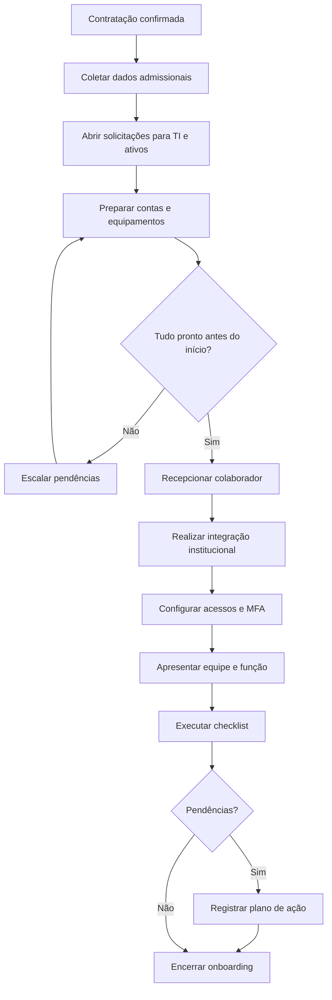

# SOP — Onboarding de Colaborador

| Campo | Informação |
| --- | --- |
| **Código** | SOP-RH-001 |
| **Versão** | 1.0 |
| **Status** | Aprovado / Em revisão |
| **Área** | Recursos Humanos |
| **Proprietário do Processo** | RH |
| **Aprovador** | Gestor contratante |
| **Periodicidade de Revisão** | Anual ou após mudança relevante |
| **Classificação** | Uso interno |

## 1. Objetivo

Garantir que novos colaboradores iniciem com documentação, acessos, equipamentos, orientações e responsabilidades adequadamente definidos.

## 2. Escopo

### Inclui
- Novos colaboradores, estagiários e terceiros quando aplicável.
- Integração administrativa, tecnológica e funcional.

### Não inclui
- Recrutamento e seleção.
- Treinamentos técnicos avançados pós-onboarding.

## 3. Entradas

| Entrada | Origem | Obrigatória |
| --- | --- | --- |
| Dados admissionais | RH | Sim |
| Cargo e gestor | Área contratante | Sim |
| Perfil de acesso | Gestor / TI | Sim |
| Equipamentos necessários | Gestor / TI | Sim |

## 4. Saídas

| Saída | Destino | Evidência |
| --- | --- | --- |
| Colaborador admitido | RH | Registro funcional |
| Conta e acessos provisionados | TI | Logs / chamados |
| Equipamentos entregues | Colaborador | Termo de responsabilidade |
| Integração concluída | Gestor | Checklist |

## 5. Papéis e Responsabilidades — RACI

**Legenda:** R = executa; A = responsável final; C = consultado; I = informado.

| Atividade | Solicitante | Executor | Gestor | Especialista/Owner |
| --- | --- | --- | --- | --- |
| Preparar admissão | R | C | A | I |
| Criar contas e acessos | C | R | A | I |
| Preparar equipamentos | C | R | A | I |
| Realizar integração | R | C | A | I |
| Validar conclusão | C | C | R/A | I |

## 6. Fluxograma

## 7. Procedimento Detalhado

1. Confirmar data de início, cargo, gestor, local e modalidade de trabalho.
2. Concluir documentação admissional e registros obrigatórios.
3. Abrir solicitações para e-mail, identidade corporativa, grupos e sistemas.
4. Aplicar perfil mínimo necessário conforme função.
5. Preparar notebook, periféricos, telefonia e demais ativos.
6. Configurar MFA e requisitos de segurança.
7. Enviar agenda do primeiro dia e materiais de integração.
8. Apresentar políticas, código de conduta, segurança e canais internos.
9. Realizar apresentação da equipe, objetivos da função e plano inicial.
10. Concluir checklist e registrar pendências com responsáveis e prazos.

## 8. Regras de Negócio

| ID | Regra |
| --- | --- |
| RN-01 | Acessos devem seguir o princípio do menor privilégio. |
| RN-02 | Credenciais iniciais não devem ser compartilhadas por canais inseguros. |
| RN-03 | Equipamentos corporativos exigem termo de responsabilidade. |
| RN-04 | Treinamentos obrigatórios devem ser concluídos no prazo definido. |

## 9. Exceções e Tratamento

| Exceção | Tratamento |
| --- | --- |
| Início emergencial | Priorizar acessos mínimos e registrar pendências. |
| Equipamento indisponível | Provisionar alternativa temporária aprovada. |
| Terceiro sem vínculo direto | Aplicar fluxo específico de acesso e prazo de expiração. |

## 10. SLA e Prazos

| Atividade | Prazo |
| --- | --- |
| Abertura das solicitações | Até 2 dias úteis antes do início, idealmente |
| Conta corporativa | Pronta até o primeiro dia |
| Equipamento | Disponível no primeiro dia |
| Pendências críticas | Resolver em até 1 dia útil |

## 11. Riscos e Controles

| ID | Risco | Probabilidade | Impacto | Controle |
| --- | --- | --- | --- | --- |
| R01 | Acesso excessivo | Média | Alto | Perfis por função e aprovação |
| R02 | Início sem recursos | Média | Médio | Checklist pré-admissão |
| R03 | Falha em treinamento obrigatório | Média | Alto | Controle de conclusão |
| R04 | Ativo sem rastreabilidade | Baixa | Médio | Inventário e termo |

## 12. Evidências Obrigatórias

- [ ] Checklist de onboarding
- [ ] Termo de equipamento
- [ ] Chamados de acesso
- [ ] Registro de treinamentos
- [ ] Aprovações do gestor

## 13. Indicadores — KPIs

| Indicador | Cálculo | Meta |
| --- | --- | --- |
| Onboardings prontos no D1 | Onboardings sem pendência crítica / total | ≥ 95% |
| Tempo de provisionamento | Tempo médio dos chamados | Conforme SLA |
| Treinamento obrigatório concluído | Concluídos / total | 100% |
| Pendências após 5 dias | Onboardings com pendência / total | ≤ 5% |

## 14. Checklist Operacional

### Antes
- [ ] Entradas obrigatórias recebidas
- [ ] Responsáveis identificados
- [ ] Aprovações necessárias confirmadas
- [ ] Riscos relevantes avaliados

### Durante
- [ ] Etapas executadas na ordem prevista
- [ ] Desvios registrados
- [ ] Evidências coletadas
- [ ] Comunicações realizadas

### Depois
- [ ] Resultado validado
- [ ] Pendências atribuídas
- [ ] Evidências arquivadas
- [ ] Processo encerrado no sistema

## 15. Auditoria

A execução deve permitir identificar, no mínimo:

- quem solicitou;
- quem aprovou;
- quem executou;
- data e hora das principais etapas;
- desvios ou exceções;
- evidências produzidas;
- resultado final.

## 16. Histórico de Revisões

| Versão | Data | Autor | Alteração |
|---|---|---|---|
| 1.0 | {Data} | {Autor} | Criação do procedimento detalhado |

## 17. Aprovação

| Papel | Nome | Data | Status |
|---|---|---|---|
| Elaborado por | {Nome} | {Data} | {Status} |
| Revisado por | {Nome} | {Data} | {Status} |
| Aprovado por | {Nome} | {Data} | {Status} |
