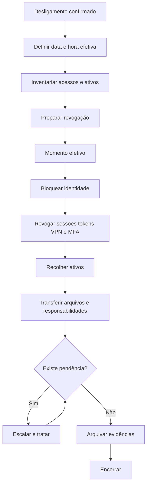

# SOP — Offboarding de Colaborador

| Campo | Informação |
| --- | --- |
| **Código** | SOP-RH-002 |
| **Versão** | 1.0 |
| **Status** | Aprovado / Em revisão |
| **Área** | Recursos Humanos / TI |
| **Proprietário do Processo** | RH |
| **Aprovador** | Gestor da área / RH |
| **Periodicidade de Revisão** | Anual ou após mudança relevante |
| **Classificação** | Uso interno |

## 1. Objetivo

Executar desligamentos de forma segura, coordenada e auditável, reduzindo riscos de acesso indevido e perda de ativos ou conhecimento.

## 2. Escopo

### Inclui
- Colaboradores, estagiários e terceiros desligados.
- Revogação de acessos, devolução de ativos e transferência de responsabilidades.

### Não inclui
- Processos trabalhistas e rescisórios detalhados.
- Descarte físico de equipamentos, quando tratado em SOP próprio.

## 3. Entradas

| Entrada | Origem | Obrigatória |
| --- | --- | --- |
| Confirmação de desligamento | RH | Sim |
| Data e hora efetiva | RH | Sim |
| Inventário de acessos | TI | Sim |
| Inventário de ativos | TI / Facilities | Sim |

## 4. Saídas

| Saída | Destino | Evidência |
| --- | --- | --- |
| Acessos revogados | TI | Logs |
| Ativos devolvidos | TI / Facilities | Termo |
| Responsabilidades transferidas | Gestor | Registro |
| Checklist concluído | RH | Checklist final |

## 5. Papéis e Responsabilidades — RACI

**Legenda:** R = executa; A = responsável final; C = consultado; I = informado.

| Atividade | Solicitante | Executor | Gestor | Especialista/Owner |
| --- | --- | --- | --- | --- |
| Comunicar desligamento | R | I | A | I |
| Revogar acessos | C | R | A | I |
| Recolher ativos | C | R | A | I |
| Transferir responsabilidades | I | C | R/A | I |
| Encerrar checklist | R | C | A | I |

## 6. Fluxograma

## 7. Procedimento Detalhado

1. Confirmar data e hora efetiva do desligamento e nível de confidencialidade.
2. Identificar todas as contas, grupos, aplicações, VPNs, chaves, tokens e dispositivos.
3. Programar revogação coordenada para o momento definido pelo RH.
4. Bloquear identidade principal e encerrar sessões ativas.
5. Revogar acessos privilegiados, MFA, certificados, tokens e integrações pessoais.
6. Alterar credenciais de contas compartilhadas quando houver conhecimento pelo desligado.
7. Recolher notebook, crachá, tokens, chaves e demais ativos.
8. Transferir propriedade de arquivos, caixas compartilhadas, projetos e responsabilidades.
9. Configurar resposta automática ou redirecionamento quando aprovado.
10. Concluir checklist, registrar evidências e escalar qualquer ativo ou acesso não encerrado.

## 8. Regras de Negócio

| ID | Regra |
| --- | --- |
| RN-01 | Acessos devem ser revogados no horário determinado pelo RH. |
| RN-02 | Contas privilegiadas têm prioridade máxima de revogação. |
| RN-03 | Contas compartilhadas conhecidas pelo desligado devem ter credenciais alteradas. |
| RN-04 | Nenhuma pendência crítica pode ser encerrada sem responsável e prazo. |

## 9. Exceções e Tratamento

| Exceção | Tratamento |
| --- | --- |
| Desligamento imediato | Executar bloqueio prioritário antes de etapas administrativas. |
| Ativo não devolvido | Registrar ocorrência e acionar RH/gestor. |
| Conta desconhecida | Realizar varredura adicional de IAM, logs e gestores de sistemas. |

## 10. SLA e Prazos

| Atividade | Prazo |
| --- | --- |
| Bloqueio principal | No momento efetivo |
| Revogação privilegiada | Imediata |
| Revogação de acessos comuns | Até 30 min após desligamento |
| Tratamento de ativo pendente | Até 1 dia útil |

## 11. Riscos e Controles

| ID | Risco | Probabilidade | Impacto | Controle |
| --- | --- | --- | --- | --- |
| R01 | Acesso após desligamento | Baixa | Crítico | Revogação coordenada |
| R02 | Perda de dados | Média | Alto | Transferência de propriedade |
| R03 | Ativo não recuperado | Média | Médio | Inventário e termo |
| R04 | Conta compartilhada comprometida | Baixa | Alto | Troca de credenciais |

## 12. Evidências Obrigatórias

- [ ] Checklist de desligamento
- [ ] Logs de revogação
- [ ] Termo de devolução
- [ ] Registro de transferência
- [ ] Aprovações e exceções

## 13. Indicadores — KPIs

| Indicador | Cálculo | Meta |
| --- | --- | --- |
| Revogações no prazo | Offboardings no SLA / total | 100% para acessos críticos |
| Ativos recuperados | Ativos devolvidos / ativos previstos | 100% |
| Pendências pós-desligamento | Offboardings com pendência / total | ≤ 2% |
| Tempo de bloqueio | Tempo entre desligamento e bloqueio | ≤ 15 min |

## 14. Checklist Operacional

### Antes
- [ ] Entradas obrigatórias recebidas
- [ ] Responsáveis identificados
- [ ] Aprovações necessárias confirmadas
- [ ] Riscos relevantes avaliados

### Durante
- [ ] Etapas executadas na ordem prevista
- [ ] Desvios registrados
- [ ] Evidências coletadas
- [ ] Comunicações realizadas

### Depois
- [ ] Resultado validado
- [ ] Pendências atribuídas
- [ ] Evidências arquivadas
- [ ] Processo encerrado no sistema

## 15. Auditoria

A execução deve permitir identificar, no mínimo:

- quem solicitou;
- quem aprovou;
- quem executou;
- data e hora das principais etapas;
- desvios ou exceções;
- evidências produzidas;
- resultado final.

## 16. Histórico de Revisões

| Versão | Data | Autor | Alteração |
|---|---|---|---|
| 1.0 | {Data} | {Autor} | Criação do procedimento detalhado |

## 17. Aprovação

| Papel | Nome | Data | Status |
|---|---|---|---|
| Elaborado por | {Nome} | {Data} | {Status} |
| Revisado por | {Nome} | {Data} | {Status} |
| Aprovado por | {Nome} | {Data} | {Status} |
