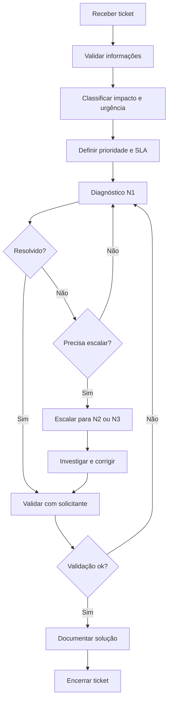

# SOP — Tratamento de Chamados

| Campo | Informação |
| --- | --- |
| **Código** | SOP-SUP-001 |
| **Versão** | 1.0 |
| **Status** | Aprovado / Em revisão |
| **Área** | Suporte / Service Desk |
| **Proprietário do Processo** | Coordenação de Suporte |
| **Aprovador** | Gestor de Suporte |
| **Periodicidade de Revisão** | Anual ou após mudança relevante |
| **Classificação** | Uso interno |

## 1. Objetivo

Garantir triagem, priorização, resolução, comunicação e encerramento consistentes de solicitações e incidentes.

## 2. Escopo

### Inclui
- Tickets de suporte interno ou externo.
- Solicitações, dúvidas, incidentes e requisições de serviço.

### Não inclui
- Incidentes críticos tratados em processo de major incident.
- Demandas de projeto ou desenvolvimento sem vínculo com suporte.

## 3. Entradas

| Entrada | Origem | Obrigatória |
| --- | --- | --- |
| Ticket | Usuário / cliente / monitoramento | Sim |
| Descrição do problema | Solicitante | Sim |
| Evidências | Solicitante / monitoramento | Quando disponível |
| Impacto percebido | Solicitante | Sim |

## 4. Saídas

| Saída | Destino | Evidência |
| --- | --- | --- |
| Solução aplicada | Solicitante | Registro no ticket |
| Ticket escalado | Nível superior | Histórico |
| Base de conhecimento atualizada | Suporte | Artigo quando aplicável |

## 5. Papéis e Responsabilidades — RACI

**Legenda:** R = executa; A = responsável final; C = consultado; I = informado.

| Atividade | Solicitante | Executor | Gestor | Especialista/Owner |
| --- | --- | --- | --- | --- |
| Abrir ticket | R | I | I | I |
| Classificar | C | R | A | I |
| Resolver N1 | I | R | A | I |
| Escalar | I | R | A | C |
| Encerrar | C | R | A | I |

## 6. Fluxograma

## 7. Procedimento Detalhado

1. Receber ticket e confirmar informações mínimas.
2. Classificar categoria, serviço, impacto e urgência.
3. Definir prioridade conforme matriz.
4. Confirmar SLA aplicável e comunicar expectativa inicial.
5. Pesquisar base de conhecimento e histórico.
6. Executar diagnóstico e solução de primeiro nível.
7. Escalar quando exceder competência, tempo limite ou criticidade.
8. Manter o solicitante atualizado em intervalos adequados.
9. Validar resultado com solicitante ou por evidência técnica.
10. Registrar causa, solução e encerrar com categorização correta.

## 8. Regras de Negócio

| ID | Regra |
| --- | --- |
| RN-01 | Prioridade deve considerar impacto e urgência, não somente percepção do solicitante. |
| RN-02 | Tickets críticos exigem comunicação frequente. |
| RN-03 | Escalonamento deve incluir evidências e diagnóstico já realizado. |
| RN-04 | Encerramento deve conter solução e categoria final. |

## 9. Exceções e Tratamento

| Exceção | Tratamento |
| --- | --- |
| Chamado sem informação mínima | Solicitar complemento e pausar SLA se política permitir. |
| Incidente crítico | Acionar processo de gestão de incidentes. |
| Demanda fora de escopo | Redirecionar para fila/processo correto. |

## 10. SLA e Prazos

| Atividade | Prazo |
| --- | --- |
| P1 - primeira resposta | 15 minutos |
| P2 - primeira resposta | 30 minutos |
| P3 - primeira resposta | 4 horas úteis |
| P4 - primeira resposta | 1 dia útil |

## 11. Riscos e Controles

| ID | Risco | Probabilidade | Impacto | Controle |
| --- | --- | --- | --- | --- |
| R01 | Classificação incorreta | Média | Médio | Matriz de prioridade |
| R02 | SLA violado | Média | Alto | Alertas e escalonamento |
| R03 | Solução sem evidência | Média | Médio | Registro obrigatório |
| R04 | Reincidência | Média | Médio | Base de conhecimento e análise de causa |

## 12. Evidências Obrigatórias

- [ ] Ticket
- [ ] Logs / prints
- [ ] Comunicações
- [ ] Escalonamentos
- [ ] Solução aplicada
- [ ] Validação final

## 13. Indicadores — KPIs

| Indicador | Cálculo | Meta |
| --- | --- | --- |
| SLA de primeira resposta | Tickets no SLA / total | ≥ 95% |
| SLA de resolução | Tickets resolvidos no SLA / total | ≥ 90% |
| Taxa de reabertura | Tickets reabertos / total | ≤ 5% |
| FCR | Resolvidos no primeiro contato / total | Meta por operação |

## 14. Checklist Operacional

### Antes
- [ ] Entradas obrigatórias recebidas
- [ ] Responsáveis identificados
- [ ] Aprovações necessárias confirmadas
- [ ] Riscos relevantes avaliados

### Durante
- [ ] Etapas executadas na ordem prevista
- [ ] Desvios registrados
- [ ] Evidências coletadas
- [ ] Comunicações realizadas

### Depois
- [ ] Resultado validado
- [ ] Pendências atribuídas
- [ ] Evidências arquivadas
- [ ] Processo encerrado no sistema

## 15. Auditoria

A execução deve permitir identificar, no mínimo:

- quem solicitou;
- quem aprovou;
- quem executou;
- data e hora das principais etapas;
- desvios ou exceções;
- evidências produzidas;
- resultado final.

## 16. Histórico de Revisões

| Versão | Data | Autor | Alteração |
|---|---|---|---|
| 1.0 | {Data} | {Autor} | Criação do procedimento detalhado |

## 17. Aprovação

| Papel | Nome | Data | Status |
|---|---|---|---|
| Elaborado por | {Nome} | {Data} | {Status} |
| Revisado por | {Nome} | {Data} | {Status} |
| Aprovado por | {Nome} | {Data} | {Status} |
