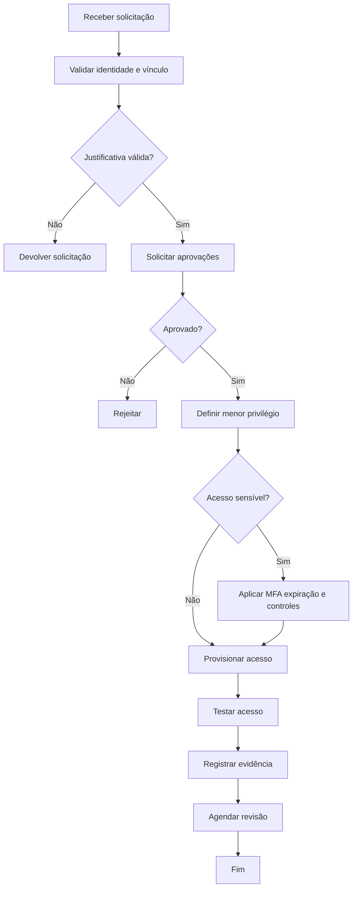

# SOP — Concessão de Acesso

| Campo | Informação |
| --- | --- |
| **Código** | SOP-TI-001 |
| **Versão** | 1.0 |
| **Status** | Aprovado / Em revisão |
| **Área** | Tecnologia / Segurança |
| **Proprietário do Processo** | TI / IAM |
| **Aprovador** | Gestor do usuário e proprietário do sistema |
| **Periodicidade de Revisão** | Anual ou após mudança relevante |
| **Classificação** | Uso interno |

## 1. Objetivo

Garantir que acessos sejam concedidos com autorização, necessidade comprovada, menor privilégio e rastreabilidade.

## 2. Escopo

### Inclui
- Aplicações, infraestrutura, dados, VPN, bancos, SaaS e privilégios administrativos.

### Não inclui
- Acessos públicos sem autenticação.
- Permissões automáticas já aprovadas por perfil de função, quando governadas por processo próprio.

## 3. Entradas

| Entrada | Origem | Obrigatória |
| --- | --- | --- |
| Solicitação de acesso | Usuário / gestor | Sim |
| Justificativa | Solicitante | Sim |
| Aprovação | Gestor / owner | Sim |
| Prazo de acesso | Gestor / owner | Quando temporário |

## 4. Saídas

| Saída | Destino | Evidência |
| --- | --- | --- |
| Acesso concedido | Usuário | Log / ticket |
| Perfil registrado | IAM / sistema | Registro |
| Data de revisão/expiração | IAM | Agenda / política |

## 5. Papéis e Responsabilidades — RACI

**Legenda:** R = executa; A = responsável final; C = consultado; I = informado.

| Atividade | Solicitante | Executor | Gestor | Especialista/Owner |
| --- | --- | --- | --- | --- |
| Solicitar acesso | R | I | A | C |
| Aprovar necessidade | I | C | R/A | C |
| Aprovar escopo técnico | I | C | C | R/A |
| Provisionar | I | R | I | I |
| Revisar acesso | I | R | A | C |

## 6. Fluxograma

## 7. Procedimento Detalhado

1. Receber solicitação com sistema, perfil, justificativa e prazo.
2. Validar identidade e vínculo ativo do usuário.
3. Confirmar aprovação do gestor e do proprietário do sistema quando aplicável.
4. Comparar acesso solicitado com perfil padrão da função.
5. Aplicar menor privilégio e remover permissões desnecessárias.
6. Configurar MFA e controles adicionais para acessos sensíveis.
7. Definir expiração para acessos temporários ou privilegiados.
8. Provisionar acesso e realizar teste controlado.
9. Comunicar o usuário sem expor credenciais sensíveis.
10. Registrar evidência e agendar revisão periódica.

## 8. Regras de Negócio

| ID | Regra |
| --- | --- |
| RN-01 | Nenhum acesso deve ser concedido sem aprovação exigida. |
| RN-02 | Acessos administrativos devem ser temporários quando tecnicamente possível. |
| RN-03 | Contas genéricas devem ser evitadas e formalmente justificadas. |
| RN-04 | Acessos devem ser revisados periodicamente e revogados quando não necessários. |

## 9. Exceções e Tratamento

| Exceção | Tratamento |
| --- | --- |
| Acesso emergencial | Conceder prazo curto, registrar justificativa e revisar posteriormente. |
| Owner indisponível | Escalar para substituto formal. |
| Perfil inexistente | Criar acesso mínimo e documentar necessidade de novo perfil. |

## 10. SLA e Prazos

| Atividade | Prazo |
| --- | --- |
| Acesso padrão | Até 1 dia útil após aprovação |
| Acesso privilegiado | Até 4 horas úteis após aprovação |
| Acesso emergencial | Conforme criticidade, com prioridade imediata |
| Revogação por perda de necessidade | Até 1 dia útil |

## 11. Riscos e Controles

| ID | Risco | Probabilidade | Impacto | Controle |
| --- | --- | --- | --- | --- |
| R01 | Privilégio excessivo | Média | Alto | Perfis RBAC e revisão |
| R02 | Acesso não autorizado | Baixa | Crítico | Aprovação e MFA |
| R03 | Acesso temporário permanente | Média | Alto | Expiração automática |
| R04 | Falta de rastreabilidade | Baixa | Médio | Ticket e logs |

## 12. Evidências Obrigatórias

- [ ] Solicitação
- [ ] Aprovações
- [ ] Log de provisionamento
- [ ] Data de expiração
- [ ] Registro de revisão

## 13. Indicadores — KPIs

| Indicador | Cálculo | Meta |
| --- | --- | --- |
| Acessos dentro do SLA | Concessões no SLA / total | ≥ 95% |
| Acessos privilegiados temporários | Temporários / total privilegiado | ≥ 90% |
| Acessos órfãos | Acessos sem owner / total | 0% |
| Revogações de revisão | Acessos removidos por revisão / total revisado | Monitorar |

## 14. Checklist Operacional

### Antes
- [ ] Entradas obrigatórias recebidas
- [ ] Responsáveis identificados
- [ ] Aprovações necessárias confirmadas
- [ ] Riscos relevantes avaliados

### Durante
- [ ] Etapas executadas na ordem prevista
- [ ] Desvios registrados
- [ ] Evidências coletadas
- [ ] Comunicações realizadas

### Depois
- [ ] Resultado validado
- [ ] Pendências atribuídas
- [ ] Evidências arquivadas
- [ ] Processo encerrado no sistema

## 15. Auditoria

A execução deve permitir identificar, no mínimo:

- quem solicitou;
- quem aprovou;
- quem executou;
- data e hora das principais etapas;
- desvios ou exceções;
- evidências produzidas;
- resultado final.

## 16. Histórico de Revisões

| Versão | Data | Autor | Alteração |
|---|---|---|---|
| 1.0 | {Data} | {Autor} | Criação do procedimento detalhado |

## 17. Aprovação

| Papel | Nome | Data | Status |
|---|---|---|---|
| Elaborado por | {Nome} | {Data} | {Status} |
| Revisado por | {Nome} | {Data} | {Status} |
| Aprovado por | {Nome} | {Data} | {Status} |
