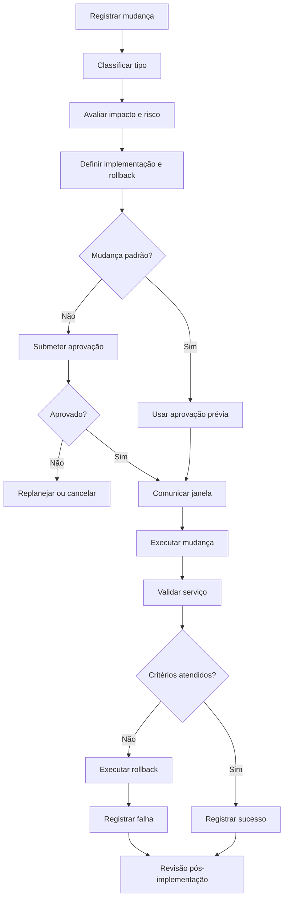

# SOP — Gestão de Mudanças

| Campo | Informação |
| --- | --- |
| **Código** | SOP-TI-002 |
| **Versão** | 1.0 |
| **Status** | Aprovado / Em revisão |
| **Área** | Tecnologia / Engenharia |
| **Proprietário do Processo** | Change Manager / Gestão de TI |
| **Aprovador** | CAB / gestor responsável, conforme risco |
| **Periodicidade de Revisão** | Anual ou após mudança relevante |
| **Classificação** | Uso interno |

## 1. Objetivo

Planejar, avaliar, aprovar, executar e revisar mudanças reduzindo indisponibilidade, falhas e impactos não previstos.

## 2. Escopo

### Inclui
- Mudanças em produção, infraestrutura, redes, bancos, aplicações e configurações críticas.

### Não inclui
- Mudanças de desenvolvimento sem impacto em ambientes controlados.
- Atividades rotineiras já classificadas como mudança padrão.

## 3. Entradas

| Entrada | Origem | Obrigatória |
| --- | --- | --- |
| Requisição de mudança | Equipe técnica | Sim |
| Plano de implementação | Executor | Sim |
| Plano de rollback | Executor | Sim |
| Avaliação de risco | Executor / gestor | Sim |

## 4. Saídas

| Saída | Destino | Evidência |
| --- | --- | --- |
| Mudança executada | Ambiente | Logs |
| Validação pós-mudança | Negócio / TI | Checklist |
| Registro de sucesso/rollback | Change Management | Ticket |

## 5. Papéis e Responsabilidades — RACI

**Legenda:** R = executa; A = responsável final; C = consultado; I = informado.

| Atividade | Solicitante | Executor | Gestor | Especialista/Owner |
| --- | --- | --- | --- | --- |
| Planejar mudança | R | C | A | I |
| Avaliar risco | R | C | A | C |
| Aprovar mudança | C | I | R/A | C |
| Executar | R | C | A | I |
| Validar | R | C | A | C |

## 6. Fluxograma

## 7. Procedimento Detalhado

1. Registrar mudança com objetivo, escopo, ativos afetados e justificativa.
2. Classificar como padrão, normal ou emergencial.
3. Avaliar impacto, risco, dependências e janela adequada.
4. Definir plano de implementação detalhado.
5. Definir critérios objetivos de sucesso e rollback.
6. Validar backup, monitoração e capacidade de reversão.
7. Obter aprovações conforme risco e criticidade.
8. Comunicar stakeholders e equipes de suporte.
9. Executar a mudança seguindo o plano e registrando horários.
10. Validar serviço, métricas e critérios de sucesso.
11. Executar rollback se os critérios não forem atendidos.
12. Encerrar com revisão pós-implementação quando necessário.

## 8. Regras de Negócio

| ID | Regra |
| --- | --- |
| RN-01 | Toda mudança normal deve possuir plano de rollback. |
| RN-02 | Mudanças emergenciais devem ser revisadas posteriormente. |
| RN-03 | Mudanças de alto risco exigem validação de backup e observabilidade. |
| RN-04 | Mudança não deve iniciar fora da janela aprovada sem nova autorização. |

## 9. Exceções e Tratamento

| Exceção | Tratamento |
| --- | --- |
| Emergência operacional | Executar fluxo emergencial com aprovação mínima e revisão posterior. |
| Rollback inviável | Exigir plano de contingência explícito e aprovação adicional. |
| Dependência externa indisponível | Reagendar ou cancelar antes da execução. |

## 10. SLA e Prazos

| Atividade | Prazo |
| --- | --- |
| Mudança normal | Avaliação conforme calendário do CAB |
| Mudança emergencial | Aprovação imediata por autoridade definida |
| Revisão pós-mudança crítica | Até 2 dias úteis |
| Registro de resultado | Até o fim da janela de mudança |

## 11. Riscos e Controles

| ID | Risco | Probabilidade | Impacto | Controle |
| --- | --- | --- | --- | --- |
| R01 | Indisponibilidade | Média | Crítico | Janela, testes e rollback |
| R02 | Falha de rollback | Baixa | Crítico | Teste prévio e backup |
| R03 | Impacto não previsto | Média | Alto | Análise de dependências |
| R04 | Mudança sem rastreabilidade | Baixa | Médio | Ticket e logs |

## 12. Evidências Obrigatórias

- [ ] Ticket de mudança
- [ ] Plano de implementação
- [ ] Plano de rollback
- [ ] Aprovações
- [ ] Comunicações
- [ ] Logs
- [ ] Validação pós-mudança

## 13. Indicadores — KPIs

| Indicador | Cálculo | Meta |
| --- | --- | --- |
| Taxa de sucesso | Mudanças sem incidente/rollback / total | ≥ 95% |
| Mudanças emergenciais | Emergenciais / total | ≤ 10% |
| Mudanças com rollback | Rollbacks / total | ≤ 5% |
| Incidentes por mudança | Incidentes relacionados / total mudanças | Tendência decrescente |

## 14. Checklist Operacional

### Antes
- [ ] Entradas obrigatórias recebidas
- [ ] Responsáveis identificados
- [ ] Aprovações necessárias confirmadas
- [ ] Riscos relevantes avaliados

### Durante
- [ ] Etapas executadas na ordem prevista
- [ ] Desvios registrados
- [ ] Evidências coletadas
- [ ] Comunicações realizadas

### Depois
- [ ] Resultado validado
- [ ] Pendências atribuídas
- [ ] Evidências arquivadas
- [ ] Processo encerrado no sistema

## 15. Auditoria

A execução deve permitir identificar, no mínimo:

- quem solicitou;
- quem aprovou;
- quem executou;
- data e hora das principais etapas;
- desvios ou exceções;
- evidências produzidas;
- resultado final.

## 16. Histórico de Revisões

| Versão | Data | Autor | Alteração |
|---|---|---|---|
| 1.0 | {Data} | {Autor} | Criação do procedimento detalhado |

## 17. Aprovação

| Papel | Nome | Data | Status |
|---|---|---|---|
| Elaborado por | {Nome} | {Data} | {Status} |
| Revisado por | {Nome} | {Data} | {Status} |
| Aprovado por | {Nome} | {Data} | {Status} |
