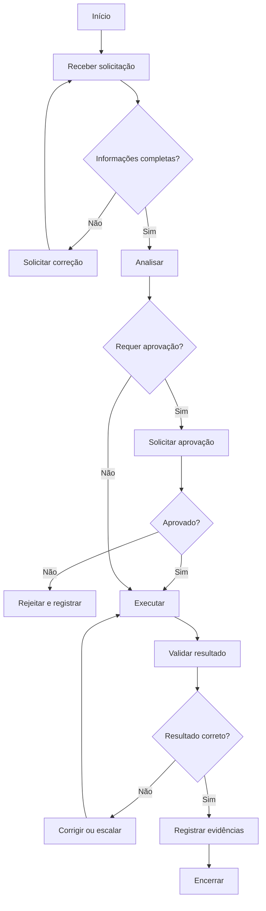

# {{Título do Procedimento}}

| Campo | Informação |
|---|---|
| **Código** | SOP-XXX-000 |
| **Versão** | 1.0 |
| **Status** | Rascunho / Em revisão / Aprovado / Obsoleto |
| **Área** | {{Área responsável}} |
| **Proprietário do Processo** | {{Responsável}} |
| **Aprovador** | {{Aprovador}} |
| **Periodicidade de Revisão** | {{Periodicidade}} |
| **Classificação** | Interno / Confidencial / Público |

## 1. Objetivo

{{Descreva o resultado que o procedimento pretende garantir.}}

## 2. Escopo

### Inclui
- {{Item 1}}
- {{Item 2}}

### Não inclui
- {{Exceção 1}}

## 3. Entradas

| Entrada | Origem | Obrigatória |
|---|---|---|
| {{Entrada}} | {{Origem}} | Sim |

## 4. Saídas

| Saída | Destino | Evidência |
|---|---|---|
| {{Resultado}} | {{Destino}} | {{Registro}} |

## 5. Papéis e Responsabilidades — RACI

**Legenda:** R = executa; A = responsável final; C = consultado; I = informado.

| Atividade | Solicitante | Executor | Gestor | Especialista/Owner |
|---|---|---|---|---|
| {{Atividade}} | R | I | A | C |

## 6. Fluxograma

## 7. Procedimento Detalhado

1. {{Etapa 1}}
2. {{Etapa 2}}
3. {{Etapa 3}}
4. {{Etapa 4}}
5. {{Etapa 5}}

## 8. Regras de Negócio

| ID | Regra |
|---|---|
| RN-01 | {{Regra}} |
| RN-02 | {{Regra}} |

## 9. Exceções e Tratamento

| Exceção | Tratamento |
|---|---|
| {{Exceção}} | {{Tratamento}} |

## 10. SLA e Prazos

| Atividade | Prazo |
|---|---|
| {{Atividade}} | {{Prazo}} |

## 11. Riscos e Controles

| ID | Risco | Probabilidade | Impacto | Controle |
|---|---|---|---|---|
| R01 | {{Risco}} | Média | Alto | {{Controle}} |

## 12. Evidências Obrigatórias

- [ ] Solicitação
- [ ] Aprovação
- [ ] Evidência de execução
- [ ] Evidência de validação
- [ ] Registro de encerramento

## 13. Indicadores — KPIs

| Indicador | Cálculo | Meta |
|---|---|---|
| Cumprimento de SLA | Demandas dentro do SLA / total | ≥ 95% |
| Taxa de retrabalho | Demandas reabertas / total | ≤ 5% |
| Taxa de erro | Demandas com erro / total | ≤ 2% |

## 14. Checklist Operacional

### Antes
- [ ] Entradas obrigatórias recebidas
- [ ] Responsáveis identificados
- [ ] Aprovações confirmadas
- [ ] Riscos avaliados

### Durante
- [ ] Etapas executadas
- [ ] Desvios registrados
- [ ] Evidências coletadas
- [ ] Comunicações realizadas

### Depois
- [ ] Resultado validado
- [ ] Pendências atribuídas
- [ ] Evidências arquivadas
- [ ] Processo encerrado

## 15. Auditoria

Registrar quem solicitou, aprovou e executou, datas, exceções, evidências e resultado final.

## 16. Histórico de Revisões

| Versão | Data | Autor | Alteração |
|---|---|---|---|
| 1.0 | {{Data}} | {{Autor}} | Criação |

## 17. Aprovação

| Papel | Nome | Data | Status |
|---|---|---|---|
| Elaborado por | {{Nome}} | {{Data}} | {{Status}} |
| Revisado por | {{Nome}} | {{Data}} | {{Status}} |
| Aprovado por | {{Nome}} | {{Data}} | {{Status}} |
